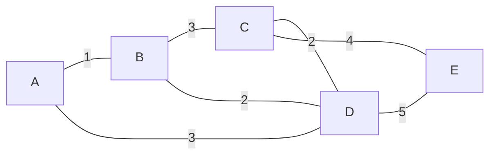
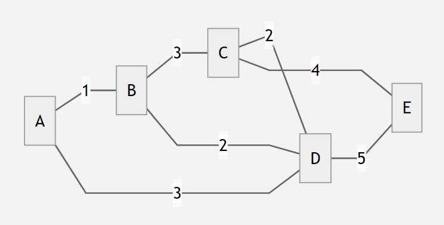

\newpage
## 4.2. Klasszikus problémák

### 4.2.1. Prim algoritmusa

#### **Alapelvek és implementáció**

Prim algoritmusa egy gráfelméleti algoritmus, amely minimális feszítőfa (Minimum Spanning Tree, MST) megtalálására szolgál súlyozott, összefüggő gráfokban. A minimális feszítőfa olyan részgráf, amely összeköti a gráf összes csúcsát, miközben a lehető legkisebb összsúlyt biztosítja. Az algoritmus Robert C. Prim nevéhez fűződik, és Dijkstra algoritmusának módosított változataként is ismert.

**Alapelvek**

Prim algoritmusa egy mohó algoritmus, ami azt jelenti, hogy minden lépésben a lokálisan optimális döntést hozza meg, remélve, hogy ez globálisan is optimális megoldáshoz vezet. Az algoritmus a következő alapelveken nyugszik:

1. **Kezdés egy tetszőleges csúccsal**: Válasszunk ki egy kezdő csúcsot a gráfból.
2. **Feszítőfa fokozatos építése**: Iteratívan bővítjük a feszítőfát úgy, hogy minden lépésben a legkisebb súlyú élt adjuk hozzá, amely összeköti a fát egy még nem tartalmazott csúccsal.
3. **Minimális él kiválasztása**: Mindig az aktuális feszítőfához legközelebb eső csúcsot választjuk a legkisebb súlyú él mentén.

**Algoritmus lépései**

1. **Inicializáció**:
    - Válasszunk ki egy kezdő csúcsot és adjuk hozzá a feszítőfához.
    - Jelöljük meg ezt a csúcsot meglátogatottnak.
    - Inicializáljuk a szükséges adatszerkezeteket, például egy prioritási sorral, amely az éleket és azok súlyait tartalmazza.

2. **Iterációk**:
    - Mindaddig ismételjük a következő lépéseket, amíg a feszítőfa nem tartalmazza az összes csúcsot:
        - Válasszuk ki a prioritási sorból a legkisebb súlyú élt, amely egy meglátogatott csúcsot egy még nem látogatott csúccsal köt össze.
        - Adjuk hozzá ezt az élt és a hozzá tartozó új csúcsot a feszítőfához.
        - Jelöljük meg az új csúcsot meglátogatottnak.
        - Frissítsük a prioritási sort az új csúcsból kiinduló élekkel.

3. **Befejezés**:
    - Az algoritmus véget ér, amikor a feszítőfa az összes csúcsot tartalmazza.

**Implementáció**

Az alábbiakban egy Prim algoritmus implementációját láthatjuk C++ nyelven:

```cpp
#include <iostream>

#include <vector>
#include <queue>

#include <utility>
#include <functional>

using namespace std;

typedef pair<int, int> Edge; // (weight, vertex)
typedef vector<vector<Edge>> Graph;

vector<Edge> prim(const Graph &graph) {
    int n = graph.size();
    vector<bool> visited(n, false);
    priority_queue<Edge, vector<Edge>, greater<Edge>> pq;
    vector<Edge> mst;

    auto add_edges = [&](int v) {
        visited[v] = true;
        for (const auto &edge : graph[v]) {
            if (!visited[edge.second]) {
                pq.push(edge);
            }
        }
    };

    // Start from vertex 0 (arbitrary choice)
    add_edges(0);

    while (!pq.empty() && mst.size() < n - 1) {
        auto [weight, u] = pq.top();
        pq.pop();
        if (!visited[u]) {
            mst.push_back({weight, u});
            add_edges(u);
        }
    }

    return mst;
}

int main() {
    int n = 5;
    Graph graph(n);
    
    // Constructing a sample graph
    graph[0] = {{1, 1}, {3, 3}};
    graph[1] = {{1, 0}, {3, 2}, {6, 3}};
    graph[2] = {{3, 1}, {2, 3}, {4, 4}};
    graph[3] = {{3, 0}, {6, 1}, {2, 2}, {5, 4}};
    graph[4] = {{4, 2}, {5, 3}};
    
    auto mst = prim(graph);
    
    cout << "Edges in MST:" << endl;
    for (const auto &[weight, vertex] : mst) {
        cout << vertex << " - weight: " << weight << endl;
    }

    return 0;
}
```

#### **Alkalmazások és példák**

Prim algoritmusának széleskörű alkalmazásai vannak a különböző területeken:

1. **Hálózatok tervezése**:
    - **Távközlési hálózatok**: Optimális útvonalak kialakítása a kapcsolatok minimális költsége mellett.
    - **Víz- és villamosenergia-hálózatok**: Hasonlóképpen, minimális költségű infrastruktúra létrehozása.

2. **Utazó ügynök problémája (TSP)**: Bár a TSP megoldása általában nem egyszerű, a minimális feszítőfa jó kiindulópont lehet heurisztikus megoldásokhoz.

3. **Képfeldolgozás és gépi látás**: Objektek szegmentálása és összekapcsolása a legkisebb költség alapján.

4. **Geometriai alkalmazások**:
    - **Legközelebbi pontok összekapcsolása**: A legkisebb összekötő útvonalak keresése a pontok között, például grafikus megjelenítésben.

**Példa**:

Tegyük fel, hogy egy telekommunikációs cég egy új hálózatot szeretne kiépíteni öt város között, és minimalizálni kívánja a kábelezés költségeit. Az alábbi súlyozott gráf szemlélteti a városokat és a közöttük lévő lehetséges kapcsolatokat, ahol az élek súlyai a kábelezés költségét reprezentálják.




A fenti gráf alapján a Prim algoritmusa által létrehozott minimális feszítőfa a következő éleket fogja tartalmazni (feltételezve, hogy a kiindulási csúcs a 0):

1. 0 - 1 (súly: 1)
2. 1 - 2 (súly: 3)
3. 2 - 3 (súly: 2)
4. 3 - 4 (súly: 5)

Az összes élsúly összege 11, amely a minimális összköltséget jelenti a hálózat kiépítéséhez.

**Összegzés**

Prim algoritmusa egy hatékony módszer minimális feszítőfák megtalálására, amely különösen hasznos különböző hálózattervezési problémák esetében. Az algoritmus előnye, hogy relatíve egyszerűen implementálható és adaptálható különböző típusú gráfokra, miközben garantáltan optimális megoldást nyújt összefüggő, súlyozott gráfok esetében.

### 4.2.2. Kruskal algoritmusa

#### **Alapelvek és implementáció**

Kruskal algoritmusa szintén a minimális feszítőfa (Minimum Spanning Tree, MST) problémájának megoldására szolgál, azonban más módszert használ, mint Prim algoritmusa. Ezt az algoritmust Joseph Kruskal fejlesztette ki 1956-ban. Kruskal algoritmusa az élekre koncentrál, és a gráf éleinek fokozatos hozzáadásával építi fel a minimális feszítőfát, amíg az nem tartalmazza az összes csúcsot.

**Alapelvek**

Kruskal algoritmusa egy mohó algoritmus, mely a következő alapelveket követi:

1. **Élek rendezése**: Az összes élt a súlyuk szerint növekvő sorrendbe rendezzük.
2. **Minimális él kiválasztása**: Az éleket sorban hozzáadjuk a feszítőfához, feltéve, hogy ez nem hoz létre kört.
3. **Feszítőfa építése**: Addig ismételjük az előző lépést, amíg a feszítőfa összes csúcsot tartalmaz.

Az algoritmus lényege, hogy minden lépésben a legkisebb súlyú élt választjuk ki, amely még nem okoz kört a már kiválasztott élek között.

**Algoritmus lépései**

1. **Inicializáció**:
    - Az összes élt rendezzük növekvő súly szerint.
    - Minden csúcsot különálló komponensként kezelünk, egy diszjunkt halmaz adatstruktúrával (Union-Find).

2. **Iterációk**:
    - Sorban vizsgáljuk az éleket a legkisebb súlytól a legnagyobbig.
    - Minden élnél ellenőrizzük, hogy a két végpontja különböző komponenshez tartozik-e.
    - Ha igen, az élt hozzáadjuk a feszítőfához, és egyesítjük a két komponenst.
    - Ha nem, az élt kihagyjuk (mivel kör keletkezne).

3. **Befejezés**:
    - Az algoritmus akkor ér véget, amikor a feszítőfa az összes csúcsot tartalmazza.

**Implementáció**

Az alábbiakban egy Kruskal algoritmus implementációját láthatjuk C++ nyelven:

```cpp
#include <iostream>

#include <vector>
#include <algorithm>

using namespace std;

typedef pair<int, pair<int, int>> Edge; // (weight, (vertex1, vertex2))

class UnionFind {
public:
    UnionFind(int n) : parent(n), rank(n, 0) {
        for (int i = 0; i < n; ++i) {
            parent[i] = i;
        }
    }

    int find(int u) {
        if (u != parent[u]) {
            parent[u] = find(parent[u]);
        }
        return parent[u];
    }

    void unite(int u, int v) {
        int rootU = find(u);
        int rootV = find(v);
        if (rootU != rootV) {
            if (rank[rootU] > rank[rootV]) {
                parent[rootV] = rootU;
            } else if (rank[rootU] < rank[rootV]) {
                parent[rootU] = rootV;
            } else {
                parent[rootV] = rootU;
                ++rank[rootU];
            }
        }
    }

private:
    vector<int> parent;
    vector<int> rank;
};

vector<Edge> kruskal(int n, vector<Edge>& edges) {
    sort(edges.begin(), edges.end());
    UnionFind uf(n);
    vector<Edge> mst;

    for (const auto& edge : edges) {
        int weight = edge.first;
        int u = edge.second.first;
        int v = edge.second.second;

        if (uf.find(u) != uf.find(v)) {
            uf.unite(u, v);
            mst.push_back(edge);
        }
    }

    return mst;
}

int main() {
    int n = 5;
    vector<Edge> edges = {
        {1, {0, 1}}, {3, {0, 3}}, {3, {1, 2}}, {6, {1, 3}}, 
        {2, {2, 3}}, {4, {2, 4}}, {5, {3, 4}}
    };

    auto mst = kruskal(n, edges);

    cout << "Edges in MST:" << endl;
    for (const auto& [weight, vertices] : mst) {
        cout << vertices.first << " - " << vertices.second << " weight: " << weight << endl;
    }

    return 0;
}
```

#### **Alkalmazások és példák**

Kruskal algoritmusa különösen hasznos olyan helyzetekben, ahol a gráf ritkán kapcsolt, mivel hatékonysága részben a kevés él kezeléséből származik. Az alábbiakban néhány gyakorlati alkalmazást és példát ismertetünk.

1. **Hálózatok tervezése**:
    - **Távközlési hálózatok**: Optimális kapcsolatok kiépítése telekommunikációs rendszerekben.
    - **Villamosenergia-hálózatok**: A költségek minimalizálása az erőművek és fogyasztók közötti kapcsolatok kiépítésekor.

2. **Klaszterezés**:
    - **Klaszterezési algoritmusok**: Kruskal algoritmusa használható adatpontok klaszterezésére, különösen a hierarchikus klaszterezési módszereknél, ahol a legkisebb növekményű klasztereket választjuk ki.

3. **Képfeldolgozás**:
    - **Szegmentálás**: Objektek szegmentálása és összekapcsolása a legkisebb költség alapján, például régiók kialakítása képekben.

4. **Földrajzi információs rendszerek (GIS)**:
    - **Úthálózatok optimalizálása**: Úthálózatok, csővezetékek és egyéb infrastruktúrák költséghatékony tervezése.

**Példa**:

Vegyük példaként egy városi vízhálózat tervezését, ahol öt pontot (városokat) kell összekötni a lehető legkisebb költséggel. Az élek súlyai a csővezetékek telepítésének költségeit reprezentálják.


Az élek súly szerint rendezve:

1. 0 - 1 (súly: 1)
2. 2 - 3 (súly: 2)
3. 1 - 2 (súly: 3)
4. 0 - 3 (súly: 3)
5. 2 - 4 (súly: 4)
6. 3 - 4 (súly: 5)
7. 1 - 3 (súly: 6)

Kruskal algoritmusával a minimális feszítőfa élei a következők lesznek (feltételezve, hogy a gráf összefüggő és nincs több komponens):

1. 0 - 1 (súly: 1)
2. 2 - 3 (súly: 2)
3. 1 - 2 (súly: 3)
4. 2 - 4 (súly: 4)

Az összes élsúly összege 10, amely a minimális összköltséget jelenti a hálózat kiépítéséhez.

**Összegzés**

Kruskal algoritmusa hatékony és egyszerű módszer minimális feszítőfák megtalálására, különösen ritkán kapcsolt gráfok esetén. Az algoritmus könnyen implementálható és jól skálázható nagy gráfokra is, köszönhetően az élek rendezésének és a hatékony Union-Find adatstruktúra használatának. Az alkalmazások széles köre teszi az algoritmust fontos eszközzé mind elméleti, mind gyakorlati problémák megoldásában.

### 4.2.3. Dijkstra algoritmusa

#### **Alapelvek és implementáció**

Dijkstra algoritmusa a legrövidebb út problémájának megoldására szolgál súlyozott, irányított vagy irányítatlan gráfokban. Ezt az algoritmust Edsger W. Dijkstra fejlesztette ki 1956-ban. Az algoritmus célja a forráscsúcsból a többi csúcsba vezető legrövidebb út megtalálása, feltéve, hogy az élsúlyok nem negatívak.

**Alapelvek**

Dijkstra algoritmusa egy mohó algoritmus, amely fokozatosan építi fel a legrövidebb út fát a forráscsúcsból kiindulva. Az algoritmus a következő alapelveken nyugszik:

1. **Kezdés a forráscsúccsal**: A forráscsúcs távolsága nulla, míg a többi csúcsé végtelen.
2. **Legközelebbi csúcs kiválasztása**: Minden iterációban kiválasztjuk a még nem meglátogatott csúcsok közül azt, amelyiknek a legkisebb az aktuális távolsága a forráscsúcstól.
3. **Távolságok frissítése**: A kiválasztott csúcs összes szomszédjának frissítjük a távolságát, ha a forráscsúcstól ezen a csúcson keresztül rövidebb úton érhető el.

**Algoritmus lépései**

1. **Inicializáció**:
    - Állítsuk be a forráscsúcs távolságát 0-ra és az összes többi csúcs távolságát végtelenre.
    - Hozzunk létre egy prioritási sort (min-heap), amely a csúcsokat tartalmazza a távolságaik szerint.

2. **Iterációk**:
    - Mindaddig ismételjük a következő lépéseket, amíg a prioritási sor nem üres:
        - Válasszuk ki a prioritási sorból a legkisebb távolságú csúcsot (u).
        - Jelöljük meg u-t meglátogatottnak.
        - Frissítsük u szomszédjainak távolságát: ha egy csúcs (v) távolsága u-n keresztül kisebb, mint a korábbi távolság, akkor frissítjük a távolságot és a prioritási sorban való helyét.

3. **Befejezés**:
    - Az algoritmus véget ér, amikor az összes csúcs távolsága meg nem határozott, vagy a prioritási sor kiürül.

**Implementáció**

Az alábbiakban egy Dijkstra algoritmus implementációját láthatjuk C++ nyelven:

```cpp
#include <iostream>

#include <vector>
#include <queue>

#include <utility>
#include <functional>

#include <limits>

using namespace std;

typedef pair<int, int> Node; // (distance, vertex)
typedef vector<vector<Node>> Graph;

vector<int> dijkstra(const Graph &graph, int source) {
    int n = graph.size();
    vector<int> distances(n, numeric_limits<int>::max());
    priority_queue<Node, vector<Node>, greater<Node>> pq;
    distances[source] = 0;
    pq.push({0, source});

    while (!pq.empty()) {
        int dist = pq.top().first;
        int u = pq.top().second;
        pq.pop();

        if (dist > distances[u]) {
            continue;
        }

        for (const auto &neighbor : graph[u]) {
            int v = neighbor.second;
            int weight = neighbor.first;

            if (distances[u] + weight < distances[v]) {
                distances[v] = distances[u] + weight;
                pq.push({distances[v], v});
            }
        }
    }

    return distances;
}

int main() {
    int n = 5;
    Graph graph(n);
    
    // Constructing a sample graph
    graph[0] = {{10, 1}, {5, 3}};
    graph[1] = {{1, 2}};
    graph[2] = {{4, 4}};
    graph[3] = {{2, 1}, {9, 2}, {2, 4}};
    graph[4] = {{3, 0}, {6, 2}};
    
    int source = 0;
    auto distances = dijkstra(graph, source);
    
    cout << "Distances from source " << source << ":" << endl;
    for (int i = 0; i < n; ++i) {
        cout << "Distance to vertex " << i << ": " << distances[i] << endl;
    }

    return 0;
}
```

#### **Összehasonlítás Bellman-Ford algoritmussal**

Dijkstra algoritmusa és Bellman-Ford algoritmusa egyaránt a legrövidebb utak megtalálására szolgál, de különböző módszereket és feltételeket alkalmaznak. Az alábbiakban összehasonlítjuk a két algoritmus alapelveit, előnyeit és korlátait.

**Alapelvek**

- **Dijkstra algoritmusa**:
    - Mohó algoritmus.
    - Csak nem negatív élsúlyok esetén működik.
    - Használ prioritási sort (min-heap) a leghatékonyabb csúcs kiválasztására.

- **Bellman-Ford algoritmus**:
    - Dinamikus programozási megközelítés.
    - Kezeli a negatív élsúlyokat is, de nem negatív súlyú köröket.
    - Iteratív módon frissíti a távolságokat az összes élre minden iterációban.

**Idő- és tárigény**

- **Dijkstra algoritmusa**:
    - Időigény: $O((V + E) \log V)$, ahol $V$ a csúcsok száma és $E$ az élek száma.
    - Hatékonyabb nagy gráfok esetén, ahol az élek száma kevesebb, mint $V^2$.

- **Bellman-Ford algoritmus**:
    - Időigény: $O(VE)$.
    - Lassabb nagy gráfok esetén, különösen, ha sok él van.

**Alkalmazhatóság**

- **Dijkstra algoritmusa**:
    - Gyorsabb és hatékonyabb nem negatív élsúlyú gráfok esetén.
    - Nem használható negatív élsúlyokkal rendelkező gráfokban.

- **Bellman-Ford algoritmus**:
    - Alkalmazható negatív élsúlyú gráfokban is.
    - Képes detektálni a negatív súlyú köröket.
    - Lassabb nagy gráfok esetén.

**Összefoglalás**

Dijkstra algoritmusa ideális választás akkor, ha a gráf nem tartalmaz negatív élsúlyokat, és gyorsabb megoldást igénylünk. Ezzel szemben a Bellman-Ford algoritmus akkor jön jól, ha negatív élsúlyok is előfordulhatnak, vagy ha a negatív súlyú köröket is detektálni kell.

#### **Alkalmazások és példák**

Dijkstra algoritmusa széles körben alkalmazható különféle területeken, ahol a legrövidebb utak megtalálása szükséges. Az alábbiakban néhány gyakorlati alkalmazást és példát ismertetünk.

1. **Hálózatok tervezése**:
    - **Internethálózatok**: Az adatok legrövidebb úton történő továbbítása a forrás és a célpont között.
    - **Távközlési hálózatok**: Optimális útvonalak kialakítása a kapcsolatok minimális késleltetése mellett.

2. **Navigáció és útvonaltervezés**:
    - **GPS rendszerek**: A legrövidebb út megtalálása két helyszín között, figyelembe véve az útvonalak hosszát és a forgalmat.
    - **Autonóm járművek**: Az optimális útvonal megtervezése a cél elérése érdekében.

3. **Logisztika és szállítmányozás**:
    - **Szállítmányok optimalizálása**: A legrövidebb és leggyorsabb út megtalálása az áruk szállításához.
    - **Ellátási lánc menedzsment**: A legkisebb költségű útvonalak meghatározása a termékek és nyersanyagok szállítására.

**Példa**:

Tegyük fel, hogy egy városi közlekedési hálózatot kell optimalizálni. Az alábbi gráf szemlélteti a város különböző pontjait és a közöttük lévő úthálózatot, ahol az élek súlyai az utak hosszát reprezentálják.


A forráscsúcs 0. Dijkstra algoritmusával a legrövidebb utak a következőképpen alakulnak:

1. **Távolság a 0 csúcshoz**: 0 (kiindulópont).
2. **Távolság az 1 csúcshoz**: 10.
3. **Távolság a 2 csúcshoz**: 14.
4. **Távolság a 3 csúcshoz**: 5.
5. **Távolság a 4 csúcshoz**: 7.

A legrövidebb utak a következőképpen alakulnak:

- 0 → 1: távolság = 10
- 0 → 3 → 2: távolság = 5 + 9 = 14
- 0 → 3: távolság = 5
- 0 → 3 → 4: távolság = 5 + 2 = 7

**Összegzés**

Dijkstra algoritmusa hatékony és gyors megoldást kínál a legrövidebb út problémájára nem negatív élsúlyú gráfok esetén. Az algoritmus egyszerűen implementálható és jól skálázható nagy gráfokra is, különösen, ha a prioritási sort megfelelően használjuk. Az alkalmazások széles köre teszi az algoritmust alapvető eszközzé a számítástudomány és az operációkutatás különböző területein.

Elnézést a félreértésért, valóban szükséges bemutatni egy mohó algoritmust is az érmék összegzése probléma megoldására. A következő részben egy mohó algoritmus kerül bemutatásra a probléma megoldására.

### 4.2.4. Érmék összegzése (Coin Change)

#### **Alapelvek és implementáció**

Az érmék összegzése probléma (Coin Change problem) egy klasszikus probléma, amelyre kétféle megközelítést alkalmazhatunk: dinamikus programozást és mohó algoritmust. Ebben a fejezetben a mohó algoritmus kerül részletes bemutatásra, amely egyszerű és hatékony, de nem mindig garantálja az optimális megoldást.

**Probléma megfogalmazása**

Adott egy érmék listája különböző címletekkel és egy célösszeg (amount). A feladat meghatározni a minimális számú érmét, amelyek összege pontosan megegyezik a célösszeggel, vagy megállapítani, hogy ez nem lehetséges.

**Mohó algoritmus alapelve**

A mohó algoritmus az alábbi alapelvekre épül:

1. **Legnagyobb címlet kiválasztása**: Mindig válasszuk ki a legnagyobb címletű érmét, amely nem haladja meg az aktuális célt.
2. **Aktuális cél frissítése**: Vonjuk le az érmék összegét az aktuális célból, és ismételjük a folyamatot, amíg a cél nulla nem lesz vagy nem találunk megfelelő érmét.

**Mohó algoritmus lépései**

1. **Inicializáció**: Rendezzük az érmék listáját csökkenő sorrendbe.
2. **Iteráció**:
    - Kezdjük a legnagyobb címletű érmével.
    - Adjuk hozzá ezt az érmét az eredményhez és vonjuk le az összegből.
    - Ismételjük a folyamatot a következő legnagyobb címletű érmével.
3. **Befejezés**:
    - Ha az összeg pontosan nulla, akkor megtaláltuk a megoldást.
    - Ha nem, akkor nem lehetséges a célösszeg elérése a megadott címletekkel.

**Algoritmus implementáció**

Az alábbiakban egy példa implementáció C++ nyelven:

```cpp
#include <iostream>

#include <vector>
#include <algorithm>

using namespace std;

int coinChangeGreedy(vector<int>& coins, int amount) {
    sort(coins.rbegin(), coins.rend()); // Sort coins in descending order
    int coin_count = 0;
    
    for (int coin : coins) {
        while (amount >= coin) {
            amount -= coin;
            coin_count++;
        }
    }
    
    if (amount != 0) {
        return -1; // If amount is not 0, it means change is not possible
    }
    return coin_count;
}

int main() {
    vector<int> coins = {1, 2, 5};
    int amount = 11;
    int result = coinChangeGreedy(coins, amount);

    if (result != -1) {
        cout << "Minimum coins required: " << result << endl;
    } else {
        cout << "Amount cannot be formed with given coins." << endl;
    }

    return 0;
}
```

**Példa**

Tegyük fel, hogy egy ATM gép három különböző címletű érmével rendelkezik (1, 2 és 5 egység), és az ügyfél 11 egységnyi összeget szeretne felvenni. A mohó algoritmus a következőképpen működik:

1. **Inicializáció**: Címletek rendezése csökkenő sorrendben: $[5, 2, 1]$.
2. **Iteráció**:
    - Válasszuk az 5 egységű érmét: 11 - 5 = 6, érme száma = 1.
    - Válasszuk újra az 5 egységű érmét: 6 - 5 = 1, érme száma = 2.
    - Válasszuk az 1 egységű érmét: 1 - 1 = 0, érme száma = 3.
3. **Befejezés**: Az összeg pontosan nulla, tehát az eredmény 3 érme.

**Alkalmazások és példák**

A mohó algoritmus alkalmazása az érmék összegzése problémára számos gyakorlati helyzetben előnyös lehet, különösen akkor, ha a címletek megfelelően vannak megválasztva.

1. **Pénzügyi alkalmazások**:
    - **ATM gépek**: Gyors és hatékony megoldás, ha az érmék címletei megfelelően vannak kiválasztva.
    - **Pénztárgépek**: A legkisebb számú visszajáró érme kiszámítása egyszerű és gyors algoritmussal.

2. **Logisztika és készletkezelés**:
    - **Csomagolás**: Gyorsan meghatározható a legkisebb számú csomagolási egység használata, ha a csomagolási egységek megfelelően vannak méretezve.
    - **Készletgazdálkodás**: Az optimális mennyiségű termékek kiszállítása gyors algoritmussal.

3. **Számítógépes tudomány**:
    - **Memória- és erőforrás-allokáció**: Erőforrások gyors és hatékony elosztása a legnagyobb egységek használatával.
    - **Adattömörítés**: Gyors meghatározása a legkisebb számú blokknak egy adott adatméret eléréséhez.

**Összegzés**

A mohó algoritmus egy egyszerű és gyors módszer az érmék összegzése probléma megoldására. Habár nem garantálja mindig az optimális megoldást, bizonyos helyzetekben és megfelelő címletek esetén hatékonyan használható. A dinamikus programozás és a visszalépéses keresés mellett a mohó algoritmus egy fontos eszköz a kombinatorikai optimalizálás területén.

### 4.2.5. Huffman kódolás

#### **Mohó megközelítés a kódok optimalizálásához**

A Huffman kódolás egy hatékony algoritmus, amelyet széles körben használnak adattömörítésre. Az algoritmus a karakterek gyakoriságának alapján állít elő optimális prefix kódokat, amelyeket a legkisebb átlagos kódhossz érdekében használhatunk. A Huffman kódolás egy tipikus példa a mohó algoritmusokra, ahol minden lépésben a legkisebb súlyú csomópontokat kombináljuk a minimális kódfahoz.

**Alapelvek**

A Huffman kódolás alapelvei a következők:

1. **Gyakorisági eloszlás meghatározása**: Az algoritmus az egyes karakterek gyakoriságát veszi figyelembe a kódfák felépítése során.
2. **Mohó építés**: Minden lépésben két legkisebb gyakoriságú csomópontot választunk ki és egy új csomópontba egyesítjük őket, amelynek gyakorisága a két csomópont gyakoriságának összege lesz.
3. **Prefix kódok**: A létrehozott bináris kódfán minden levélcsomópont egy karaktert képvisel, és a karakterek kódjai a gyökérből a levelekig vezető út alapján kerülnek meghatározásra.

**Huffman kódolás lépései**

1. **Inicializáció**:
    - Határozzuk meg az egyes karakterek gyakoriságát a bemeneti szövegben.
    - Helyezzük el az összes karaktert és azok gyakoriságát egy prioritási sorban (min-heap).

2. **Kódfa építése**:
    - Ismételjük az alábbi lépéseket, amíg csak egy csomópont marad a prioritási sorban:
        - Vegyük ki a két legkisebb gyakoriságú csomópontot a prioritási sorból.
        - Hozzunk létre egy új belső csomópontot, amelynek gyakorisága a két kivett csomópont gyakoriságának összege.
        - Helyezzük vissza az új csomópontot a prioritási sorba.
    - Az utolsó csomópont a gyökér lesz a Huffman-kódfában.

3. **Kódok meghatározása**:
    - Járjuk be a kódfát (általában mélységi kereséssel), hogy meghatározzuk a karakterek bináris kódjait a gyökérből a levelekig vezető úton.
    - Minden balra vezető élhez rendelünk egy '0'-t, minden jobbra vezető élhez egy '1'-et.

**Implementáció**

Az alábbiakban egy Huffman kódolás implementációját láthatjuk C++ nyelven:

```cpp
#include <iostream>

#include <vector>
#include <queue>

#include <unordered_map>

using namespace std;

// Node structure for Huffman Tree
struct Node {
    char character;
    int frequency;
    Node* left;
    Node* right;

    Node(char c, int f) : character(c), frequency(f), left(nullptr), right(nullptr) {}
};

// Compare function for priority queue
struct Compare {
    bool operator()(Node* left, Node* right) {
        return left->frequency > right->frequency;
    }
};

// Function to print the Huffman codes from the root of the Huffman Tree
void printCodes(Node* root, string str, unordered_map<char, string> &huffmanCode) {
    if (!root)
        return;

    if (root->character != '$')
        huffmanCode[root->character] = str;

    printCodes(root->left, str + "0", huffmanCode);
    printCodes(root->right, str + "1", huffmanCode);
}

// Main function to build the Huffman Tree and generate Huffman Codes
void huffmanCoding(vector<char>& characters, vector<int>& frequencies) {
    priority_queue<Node*, vector<Node*>, Compare> minHeap;

    for (int i = 0; i < characters.size(); ++i) {
        minHeap.push(new Node(characters[i], frequencies[i]));
    }

    while (minHeap.size() != 1) {
        Node* left = minHeap.top(); minHeap.pop();
        Node* right = minHeap.top(); minHeap.pop();

        Node* sum = new Node('$', left->frequency + right->frequency);
        sum->left = left;
        sum->right = right;

        minHeap.push(sum);
    }

    Node* root = minHeap.top();

    unordered_map<char, string> huffmanCode;
    printCodes(root, "", huffmanCode);

    cout << "Huffman Codes are:\n";
    for (auto pair : huffmanCode) {
        cout << pair.first << " " << pair.second << endl;
    }
}

int main() {
    vector<char> characters = {'a', 'b', 'c', 'd', 'e', 'f'};
    vector<int> frequencies = {5, 9, 12, 13, 16, 45};

    huffmanCoding(characters, frequencies);

    return 0;
}
```

**Mohó megközelítés elemzése**

A Huffman kódolás egy klasszikus példa a mohó algoritmusok alkalmazására, amely minden lépésben a legkisebb gyakoriságú karakterek összevonásával építi a kódfát. Az algoritmus garantálja a legrövidebb átlagos kódhosszúságot a karakterek gyakorisági eloszlása alapján.

**Idő- és tárigény**

- **Időigény**: Az algoritmus időigénye $O(n \log n)$, ahol $n$ a karakterek száma. Ez az időigény a prioritási sor kezeléséből adódik.
- **Tárigény**: A tárigény $O(n)$, mivel a kódfa felépítése és a karakterek kódjainak tárolása lineáris mennyiségű memóriát igényel.

#### **Alkalmazások és példák**

A Huffman kódolás számos gyakorlati alkalmazással rendelkezik, különösen az adattömörítés és adatátvitel területén.

1. **Adattömörítés**:
    - **ZIP fájlformátum**: A Huffman kódolást használja a fájlok hatékony tömörítésére.
    - **JPEG képek**: A képtömörítési algoritmusokban, mint a JPEG, a Huffman kódolást használják a szín- és intenzitásértékek hatékony tárolására.

2. **Adatátvitel**:
    - **Adatkommunikáció**: Az adatátvitel során a Huffman kódolás csökkenti az átvitt adatok méretét, ami gyorsabb adatátvitelt eredményez.
    - **Telekommunikáció**: Hatékony adatátviteli protokollokban használják a bitmennyiség csökkentésére.

3. **Szövegfeldolgozás**:
    - **Szövegtömörítés**: Szöveges adatok, például könyvek és dokumentumok tömörítésére használják a tárolási igény csökkentésére.

**Példa**

Tegyük fel, hogy egy szövegben a következő karakterek és gyakoriságaik találhatók: $\{a: 5, b: 9, c: 12, d: 13, e: 16, f: 45\}$. A Huffman kódolás lépései a következők lesznek:

1. **Inicializáció**: A karaktereket és gyakoriságaikat egy prioritási sorba helyezzük.
2. **Kódfa építése**:
    - Vegyük ki a két legkisebb gyakoriságú karaktert ($a: 5$ és $b: 9$), egyesítsük őket ($u: 14$).
    - Helyezzük vissza az új csomópontot a prioritási sorba, és ismételjük a folyamatot.
3. **Kódok meghatározása**:
    - A kódfa bejárásával meghatározzuk a karakterek bináris kódjait.

Az eredményül kapott Huffman kódok a következők lehetnek:

- $a: 1100$
- $b: 1101$
- $c: 100$
- $d: 101$
- $e: 111$
- $f: 0$

**Összegzés**

A Huffman kódolás egy hatékony és optimális módszer az adattömörítésre, amely a mohó algoritmusok alapelveire épül. Az algoritmus garantálja a legrövidebb átlagos kódhosszúságot a karakterek gyakorisági eloszlása alapján. A gyakorlati alkalmazások széles köre és a hatékony implementáció teszi a Huffman kódolást a modern adatfeldolgozás és adattömörítés egyik alapvető eszközévé.

### 4.2.6. Interval Scheduling

#### **Maximális számú nem átfedő intervallum kiválasztása**

#### **Alapelvek és implementáció**

Az interval scheduling probléma egy klasszikus optimalizálási probléma a mohó algoritmusok területén. A cél a lehető legtöbb nem átfedő intervallum kiválasztása egy adott intervallum halmazból. Ez a probléma számos valós alkalmazásban előfordul, mint például erőforrás-allokáció, előadások ütemezése és munkaidő beosztás.

**Probléma definíció**

Adott egy $[s_i, f_i]$ intervallumok halmaza, ahol $s_i$ az intervallum kezdete és $f_i$ az intervallum vége. A feladat a maximális számú nem átfedő intervallum kiválasztása a halmazból.

**Mohó megközelítés**

A probléma megoldására használható mohó algoritmus az alábbi alapelvekre épül:

1. **Rendezés befejezési idő szerint**: Az intervallumokat a befejezési idő szerint rendezzük növekvő sorrendbe. Ez biztosítja, hogy mindig a legkorábban végződő intervallumot válasszuk ki, ami maximalizálja az esélyét annak, hogy a későbbi intervallumok is kiválaszthatók legyenek.
2. **Intervallum kiválasztása**: Iteráljunk végig a rendezett intervallumokon, és minden intervallumot vegyünk fel a megoldásba, ha nem átfedő a korábban kiválasztott intervallumokkal.

**Algoritmus lépései**

1. **Rendezés**:
    - Rendezze az intervallumokat a befejezési idejük szerint növekvő sorrendbe.
2. **Iteráció**:
    - Kezdje az első intervallummal, és adja hozzá a megoldáshoz.
    - Iteráljon végig a többi intervallumon, és válassza ki azokat, amelyek kezdési ideje később van, mint az aktuális intervallum befejezési ideje.
3. **Befejezés**:
    - Az iteráció végén a megoldásban található intervallumok adják a maximális számú nem átfedő intervallumot.

**Algoritmus implementáció**

Az alábbiakban egy példa implementáció C++ nyelven:

```cpp
#include <iostream>

#include <vector>
#include <algorithm>

using namespace std;

struct Interval {
    int start;
    int finish;
};

bool compareIntervals(Interval i1, Interval i2) {
    return (i1.finish < i2.finish);
}

vector<Interval> intervalScheduling(vector<Interval>& intervals) {
    sort(intervals.begin(), intervals.end(), compareIntervals);

    vector<Interval> selectedIntervals;
    int currentTime = 0;

    for (const auto& interval : intervals) {
        if (interval.start >= currentTime) {
            selectedIntervals.push_back(interval);
            currentTime = interval.finish;
        }
    }

    return selectedIntervals;
}

int main() {
    vector<Interval> intervals = {{1, 3}, {2, 5}, {4, 6}, {7, 8}, {5, 9}, {8, 10}};
    vector<Interval> result = intervalScheduling(intervals);

    cout << "Selected intervals are: \n";
    for (const auto& interval : result) {
        cout << "[" << interval.start << ", " << interval.finish << "] ";
    }

    return 0;
}
```

**Idő- és tárigény**

- **Időigény**: Az algoritmus időigénye $O(n \log n)$, ahol $n$ az intervallumok száma. Ez az időigény a rendezésből adódik.
- **Tárigény**: Az algoritmus tárigénye $O(n)$, mivel tárolni kell az intervallumokat és a kiválasztott intervallumokat.

#### **Alkalmazások és példák**

Az interval scheduling probléma számos gyakorlati alkalmazással rendelkezik:

1. **Erőforrás-allokáció**:
    - **CPU idő ütemezés**: A feladatok ütemezése úgy, hogy a lehető legtöbb feladat fusson átfedés nélkül.
    - **Gépjármű ütemezés**: Az autók szervizelése egy autószervizben úgy, hogy a lehető legtöbb autót tudják megjavítani.

2. **Előadások ütemezése**:
    - **Konferencia előadások**: Az előadások ütemezése egy konferencián úgy, hogy a lehető legtöbb előadást lehessen meghallgatni átfedés nélkül.
    - **Oktatási órarend**: Az órarendek készítése úgy, hogy a lehető legtöbb órát tudják megtartani ütközés nélkül.

3. **Munkaidő beosztás**:
    - **Munkavállalók ütemezése**: A munkavállalók ütemezése úgy, hogy a lehető legtöbb műszakot le tudják fedni átfedés nélkül.
    - **Orvosi rendelők**: A betegek ütemezése orvosi rendelőkben úgy, hogy a lehető legtöbb beteg kapjon időpontot átfedés nélkül.

**Példa**

Tegyük fel, hogy egy autószerviz hat autó szervizelését kell ütemezze a nap folyamán. Az autók szervizelési ideje a következő:

1. Autó 1: [1, 3]
2. Autó 2: [2, 5]
3. Autó 3: [4, 6]
4. Autó 4: [7, 8]
5. Autó 5: [5, 9]
6. Autó 6: [8, 10]

Az algoritmus a következő lépésekben választja ki a maximális számú nem átfedő intervallumot:

1. **Rendezés**: Rendezze az intervallumokat a befejezési idejük szerint: $[1, 3], [2, 5], [4, 6], [5, 9], [7, 8], [8, 10]$.
2. **Iteráció és kiválasztás**:
    - Válassza ki az [1, 3] intervallumot.
    - Az intervallum következő kezdési ideje 4, válassza ki a [4, 6] intervallumot.
    - Az intervallum következő kezdési ideje 7, válassza ki a [7, 8] intervallumot.
    - Az intervallum következő kezdési ideje 8, válassza ki a [8, 10] intervallumot.
3. **Eredmény**: A kiválasztott intervallumok: $[1, 3], [4, 6], [7, 8], [8, 10]$.

**Összegzés**

Az interval scheduling probléma egy hatékony megoldása a mohó algoritmus, amely a befejezési idő szerinti rendezésen és a nem átfedő intervallumok kiválasztásán alapul. Az algoritmus széles körben alkalmazható a valós élet különböző területein, és garantálja a maximális számú nem átfedő intervallum kiválasztását. Az egyszerűség és a hatékonyság teszi ezt az algoritmust különösen hasznossá az ütemezési problémák megoldásában.