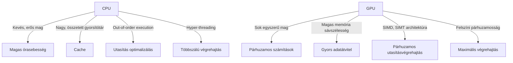
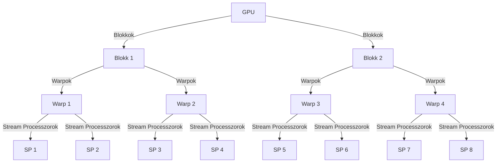
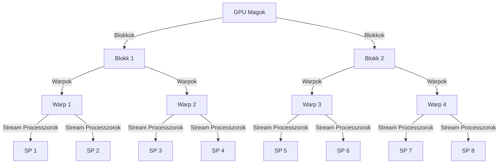
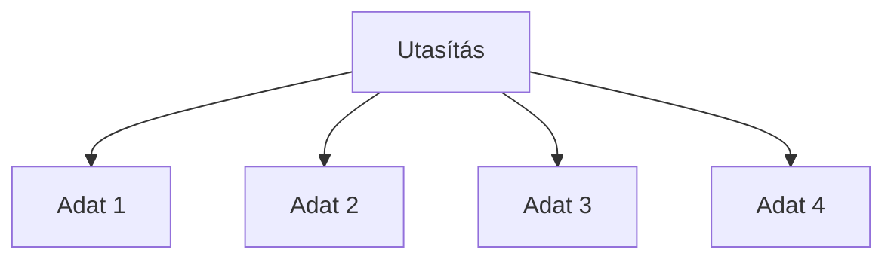
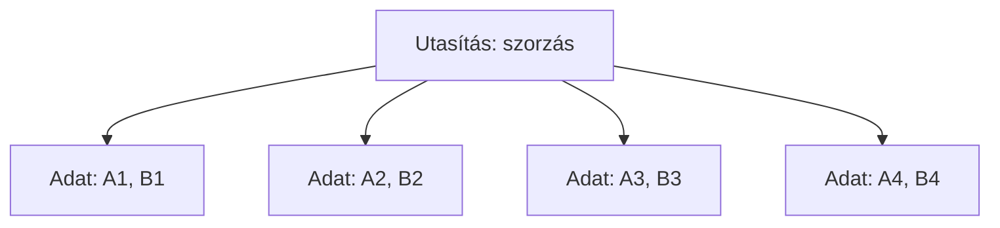
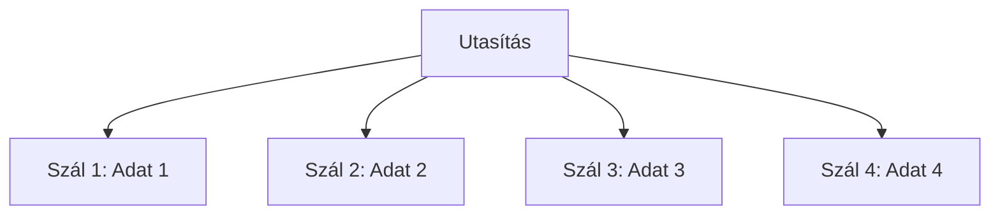
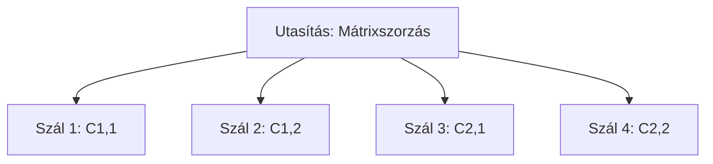

\newpage

## 2. Alapfogalmak és Architektúra

A modern számítástechnika világában a GPU-k (Graphics Processing Units) szerepe egyre nagyobb jelentőséggel bír az általános célú számítások terén is. Míg eredetileg kizárólag grafikai feladatok végrehajtására tervezték őket, a GPU-k ma már számos különböző alkalmazási területen használhatók, köszönhetően párhuzamos feldolgozási képességeiknek. Ebben a fejezetben megvizsgáljuk a GPU-k és CPU-k közötti alapvető különbségeket, feltárjuk a GPU architektúrájának sajátosságait, valamint bemutatjuk a számítási modelleket, mint például a SIMD (Single Instruction, Multiple Data) és SIMT (Single Instruction, Multiple Threads), amelyek lehetővé teszik a hatékony és gyors adatfeldolgozást. Az alapfogalmak és az architektúra megértése elengedhetetlen ahhoz, hogy kihasználhassuk a GPU-k által nyújtott előnyöket az általános célú számításokban.

### 2.1. GPU és CPU közötti különbségek

A GPU-k (Graphics Processing Units) és CPU-k (Central Processing Units) közötti különbségek megértése kulcsfontosságú ahhoz, hogy felismerjük, mikor és miért érdemes egyiket a másik helyett használni, különösen az általános célú számítások terén. Bár mindkét típusú processzor alapvetően számítások végrehajtására szolgál, architektúrájuk és működésük jelentősen eltér egymástól, ami különböző alkalmazási területeken teszi őket hatékonnyá.

#### CPU-k: Általános Célú Számítások Mesteri Végrehajtói

A CPU-k a számítógépek "agyaiként" ismertek, amelyek általános célú számítási feladatokat végeznek. Jellemzőik közé tartozik a viszonylag kevés számú, de erős mag (core), amelyek képesek összetett logikai műveletek végrehajtására. A CPU-k erőssége a gyors kontextusváltás és a különböző feladatok párhuzamos végrehajtásának képessége, amelyet a modern operációs rendszerek és szoftverek igényelnek.

A CPU-k főbb jellemzői:
- **Magas órasebesség (clock speed):** A CPU-k órasebessége általában magasabb, ami gyorsabb végrehajtást tesz lehetővé egy-egy utasítás esetében.
- **Nagy és összetett gyorsítótár (cache):** A CPU-k nagy, több szintű gyorsítótárakkal rendelkeznek, amelyek csökkentik a memóriahozzáférés késleltetését.
- **Out-of-order execution:** A CPU-k képesek az utasításokat nem sorrendben végrehajtani, hogy optimalizálják a számítási időt és a rendelkezésre álló erőforrásokat.
- **Hyper-threading:** A modern CPU-k több szálon tudnak futni egy magon belül is, növelve a párhuzamosságot és a teljesítményt.

#### GPU-k: Párhuzamos Számítások Specialistái

A GPU-k eredetileg grafikai műveletek gyors végrehajtására lettek kifejlesztve, azonban az elmúlt években egyre inkább előtérbe kerültek az általános célú párhuzamos számítások (GPGPU) terén is. A GPU-k több ezer egyszerű, de rendkívül hatékony maggal rendelkeznek, amelyek nagy mennyiségű adat párhuzamos feldolgozására alkalmasak.

A GPU-k főbb jellemzői:
- **Sok mag (core):** A GPU-k több ezer magot tartalmaznak, amelyek egyszerű utasításokat hajtanak végre párhuzamosan.
- **Magas memória sávszélesség:** A GPU-k memóriája nagy sávszélességű, ami lehetővé teszi a gyors adatátvitelt és -feldolgozást.
- **SIMD és SIMT architektúra:** A GPU-k Single Instruction, Multiple Data (SIMD) és Single Instruction, Multiple Threads (SIMT) modellben működnek, amely lehetővé teszi, hogy egy utasítást több adatelemre vagy szálra alkalmazzanak egyszerre.
- **Felszíni párhuzamosság:** A GPU-k architektúrája úgy van kialakítva, hogy maximalizálják a párhuzamos végrehajtást, minimalizálva az egyes magok közötti függőségeket.

#### GPU és CPU Különbségek Ábrázolása

A következő ábrán a CPU és GPU közötti alapvető különbségeket szemléltetjük:

#### Alkalmazási Területek és Példák

A CPU-k és GPU-k különböző alkalmazási területeken mutatják meg erősségeiket:

- **CPU:** Alkalmas operációs rendszerek futtatására, irodai alkalmazásokra, webböngészésre és olyan feladatokra, amelyek sokféle számítási típust igényelnek, például szövegszerkesztés, programozás és adatbázis-kezelés.
- **GPU:** Kiválóan alkalmas grafikai feldolgozásra, videó renderelésre, gépi tanulásra, tudományos számításokra és nagy adatbázisok párhuzamos feldolgozására.

#### Számítási Modellek és Hatékonyság

A CPU-k és GPU-k eltérő számítási modelljei különböző hatékonysági szinteket eredményeznek különböző feladatok esetében. A CPU-k in-order és out-of-order végrehajtási modelljei lehetővé teszik a bonyolult és változatos feladatok hatékony kezelését. Ezzel szemben a GPU-k SIMD és SIMT modelljei az egyszerű, ismétlődő feladatok párhuzamos végrehajtásában jeleskednek, ahol az adatok és műveletek nagy számban hasonlóak.

Összefoglalva, a CPU-k és GPU-k közötti különbségek megértése elengedhetetlen ahhoz, hogy a megfelelő számítási feladatokhoz a leghatékonyabb eszközt válasszuk. Míg a CPU-k a sokrétű, változatos feladatok mesterei, a GPU-k a párhuzamos számítások specialistái, amelyek rendkívüli teljesítményt nyújtanak nagy mennyiségű adat párhuzamos feldolgozásában.

### 2.2. GPU architektúrája

A GPU-k (Graphics Processing Units) architektúrája speciálisan a párhuzamos feldolgozási feladatokra lett tervezve, ami alapvetően különbözik a CPU-k (Central Processing Units) hagyományos felépítésétől. A GPU-kat eredetileg grafikai műveletek gyors végrehajtására fejlesztették ki, de a modern számítástechnika igényei miatt ma már általános célú számításokra (GPGPU) is széles körben használják. Ebben az alfejezetben részletesen bemutatjuk a GPU-k architektúrájának főbb elemeit és működési mechanizmusait.

#### 1. GPU Magok és Stream Processzorok

A GPU-kban található magok (cores) száma nagyságrendekkel magasabb, mint a CPU-kban. Míg egy modern CPU-ban néhány tucat mag található, egy GPU több ezer maggal rendelkezhet. Ezek a magok, gyakran "stream processzoroknak" (SP) nevezettek, egyszerűbbek és kevésbé önállóak, mint a CPU magok, de rendkívül hatékonyak az egyszerű műveletek párhuzamos végrehajtásában.

#### 2. GPU Blokkok és Warpok

A GPU-kban a magok blokkokra (blocks) vannak szervezve. Egy blokk több tucat vagy akár több száz magot is tartalmazhat, amelyek együtt dolgoznak egy adott feladaton. A blokkok tovább oszthatók "warpokra", amelyek kisebb csoportokat alkotnak, általában 32 magot tartalmaznak. A warpok egyetlen utasítást végrehajtanak egyszerre több adatelemen, ami a SIMT (Single Instruction, Multiple Threads) modell alapja.

#### 3. Memória Hierarchia

A GPU-k memóriahierarchiája különböző szintekből áll, amelyek optimalizálják az adatátvitelt és a számítási hatékonyságot:

- **Regiszterek:** Minden maghoz tartoznak regiszterek, amelyek az adott mag által használt leggyakrabban használt adatok tárolására szolgálnak.
- **Shared Memory (Megosztott memória):** Egy blokkhoz tartozó összes mag közösen használja, ami gyors adatcserét tesz lehetővé a blokk magjai között.
- **Global Memory (Globális memória):** Az egész GPU által elérhető, de lassabb, mint a megosztott memória és a regiszterek. Nagy mennyiségű adat tárolására szolgál.
- **Texture és Constant Memory:** Speciális memóriaterületek, amelyek bizonyos típusú adatokat gyorsan és hatékonyan képesek tárolni és elérni, például grafikai textúrák és állandó értékek.

#### 4. Utasításvégrehajtási Modell: SIMT

A GPU-k utasításvégrehajtási modellje a SIMT (Single Instruction, Multiple Threads), ami azt jelenti, hogy egyetlen utasítást egyszerre több szálon hajtanak végre. Ez különbözik a CPU-k SIMD (Single Instruction, Multiple Data) modelljétől, amelyben egy utasítás több adatot dolgoz fel egy időben, de ugyanazon szálon.

#### 5. Scheduling és Load Balancing

A GPU-k hatékonyságának egyik kulcsa a feladatok ütemezése (scheduling) és terheléselosztás (load balancing). A GPU-k úgy vannak kialakítva, hogy minimalizálják az egyes magok közötti függőségeket, és maximalizálják a párhuzamos végrehajtást. Az ütemező algoritmusok gondoskodnak arról, hogy a feladatok egyenletesen oszoljanak el a magok között, minimalizálva az üresjáratokat és a késleltetést.

#### 6. CUDA és OpenCL

A GPU-k programozásához különböző keretrendszerek és API-k állnak rendelkezésre, amelyek lehetővé teszik a párhuzamos számítások hatékony kihasználását:

- **CUDA (Compute Unified Device Architecture):** Az NVIDIA által kifejlesztett keretrendszer, amely lehetővé teszi a GPU-k közvetlen programozását C, C++ és Fortran nyelveken. A CUDA speciális utasításokat és könyvtárakat biztosít a párhuzamos számítások optimalizálásához.
- **OpenCL (Open Computing Language):** Egy nyílt szabvány, amelyet az Apple fejlesztett ki és azóta az egész ipar elfogadott. Az OpenCL lehetővé teszi a GPU-k és más számítási eszközök programozását különböző hardvergyártók termékein.

#### 7. Szinkronizáció és Koherencia

A párhuzamos végrehajtás során fontos a különböző szálak közötti szinkronizáció és adatkoherencia fenntartása. A GPU-k különböző szinkronizációs mechanizmusokat használnak, például barrier szinkronizációt és atomikus műveleteket, hogy biztosítsák az adatok konzisztenciáját és a versenyhelyzetek elkerülését.

#### Összefoglalás

A GPU-k architektúrája rendkívül összetett, de egyben rugalmas és hatékony a párhuzamos számítások végrehajtásában. A magok és blokkok szervezése, a memóriahierarchia, a SIMT modell, az ütemezés és a programozási keretrendszerek mind hozzájárulnak ahhoz, hogy a GPU-k kiváló teljesítményt nyújtsanak a nagy számítási igényű feladatok esetében. A következő ábrák és grafikonok további betekintést nyújtanak a GPU-k működésébe és struktúrájába, lehetővé téve a mélyebb megértést és a hatékonyabb alkalmazást.

Ez az alfejezet bemutatja, hogyan épül fel a GPU architektúrája, és hogyan teszi lehetővé a párhuzamos számítások hatékony végrehajtását, megteremtve az alapot a további fejezetekben tárgyalt konkrét alkalmazások és optimalizációs technikák számára.

### 2.3. Számítási modellek (SIMD, SIMT)

A GPU-k (Graphics Processing Units) és CPU-k (Central Processing Units) számítási modellei jelentősen különböznek egymástól, és ezen modellek megértése kulcsfontosságú a párhuzamos számítások hatékony végrehajtásához. Ebben az alfejezetben részletesen bemutatjuk a két fő számítási modellt: a SIMD (Single Instruction, Multiple Data) és a SIMT (Single Instruction, Multiple Threads) modelleket, amelyek meghatározzák a GPU-k működését és hatékonyságát.

#### 1. SIMD (Single Instruction, Multiple Data)

A SIMD egy olyan számítási modell, amelyben egyetlen utasítást hajtanak végre több adatelemen egyszerre. Ez a modell a CPU-k és néhány speciális hardverarchitektúra alapja, és különösen hatékony az olyan feladatok esetében, ahol azonos műveleteket kell végrehajtani nagyszámú adatelemen, például vektorműveleteknél és mátrixszorzásnál.

##### SIMD Működési Elve

A SIMD modellben az egyes adatpontok párhuzamos feldolgozása egyetlen utasítással történik. Ez azt jelenti, hogy egy művelet (például összeadás vagy szorzás) egyszerre több adatelemen kerül végrehajtásra, növelve ezzel a számítási sebességet és hatékonyságot.

##### SIMD Példa

Tegyük fel, hogy egy egyszerű vektorszorzást szeretnénk végrehajtani két vektoron:

$$
C[i] = A[i] \times B[i] 
$$

A SIMD modellben egyetlen utasítással egyszerre több elem szorzása hajtható végre:

##### SIMD Előnyei és Korlátai

- **Előnyök:**
    - Nagy teljesítmény növekedés párhuzamos adatok esetén.
    - Alacsonyabb energiafogyasztás, mivel egyszerre több adatot dolgoz fel.
    - Kisebb memóriahasználat és adatmozgatási igény.

- **Korlátok:**
    - Nem minden számítási probléma illeszthető a SIMD modellhez.
    - Az eltérő adatműveletek kezelése bonyolultabb, ami korlátozhatja a hatékonyságot.

#### 2. SIMT (Single Instruction, Multiple Threads)

A SIMT modell a GPU-k sajátossága, és a SIMD továbbfejlesztett változata. Ebben a modellben egyetlen utasítás egyszerre több szálon (thread) kerül végrehajtásra, amelyek mindegyike különböző adatelemeket dolgoz fel. A SIMT modell lehetővé teszi a rendkívül nagyfokú párhuzamosságot és a hatékony számítási feladatok végrehajtását.

##### SIMT Működési Elve

A SIMT modellben egyetlen utasítás egyszerre több szálat indít, amelyek mindegyike különböző adatelemeken dolgozik. Ez lehetővé teszi a GPU számára, hogy egyszerre több ezer szálat futtasson párhuzamosan, maximalizálva a számítási kapacitást.

##### SIMT Példa

Tekintsünk egy mátrixszorzási feladatot, ahol két mátrixot kell összeszoroznunk. A SIMT modellben minden szál egy-egy mátrixeletet számít ki:

##### SIMT Előnyei és Korlátai

- **Előnyök:**
    - Kiváló teljesítmény nagy adatpárhuzamosság esetén.
    - Nagy skálázhatóság, lehetővé téve több ezer szál egyidejű futtatását.
    - Rugalmas és hatékony adatkezelés.

- **Korlátok:**
    - Magasabb fejlesztési komplexitás a szinkronizáció és versenyhelyzetek kezelése miatt.
    - Az adatok közötti függőségek kezelése nehezebb lehet.

#### 3. SIMD és SIMT Összehasonlítása

A SIMD és SIMT modellek közötti fő különbségek a következők:

- **Adatkezelés:** A SIMD egyetlen utasítást hajt végre több adatelemen egyszerre, míg a SIMT egyetlen utasítást hajt végre több szálon, amelyek mindegyike különböző adatelemeket dolgoz fel.
- **Párhuzamosság:** A SIMT modell nagyobb fokú párhuzamosságot tesz lehetővé, mivel több ezer szálat képes egyszerre futtatni, míg a SIMD modell általában kisebb párhuzamosságot biztosít.
- **Szinkronizáció:** A SIMT modell nagyobb szinkronizációs és adatkoherencia kihívásokat jelent, mivel több szál egyidejű futtatása szükséges.

#### 4. Gyakorlati Alkalmazások

- **SIMD alkalmazások:** Kiválóan alkalmasak vektorműveletekre, digitális jelfeldolgozásra (DSP), kriptográfiára és olyan tudományos számításokra, ahol nagy mennyiségű adatot kell párhuzamosan feldolgozni.
- **SIMT alkalmazások:** Ideálisak grafikai feldolgozásra, gépi tanulásra, adatbányászatra és szimulációkra, ahol rendkívül nagy számítási kapacitás és párhuzamosság szükséges.

#### Összefoglalás

A SIMD és SIMT számítási modellek alapvető szerepet játszanak a modern számítástechnikában, különösen a párhuzamos feldolgozás terén. A SIMD modell egyszerű és hatékony, különösen a vektorműveletek és a digitális jelfeldolgozás esetében, míg a SIMT modell nagyobb párhuzamosságot és számítási kapacitást biztosít, amely lehetővé teszi a GPU-k számára, hogy kiváló teljesítményt nyújtsanak a grafikai feldolgozás és a gépi tanulás terén. Az ezen modellek közötti különbségek és alkalmazási területek megértése kulcsfontosságú a párhuzamos számítások hatékony kihasználásához.

