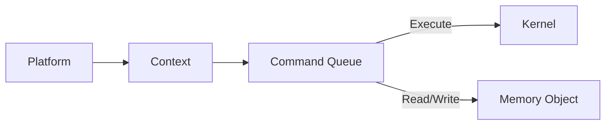

\newpage
## 3. Programozási Nyelvek és Eszközök

A GPU-alapú általános célú számítások (GPGPU) hatékony kihasználása érdekében speciális programozási nyelvekre és eszközökre van szükség, amelyek lehetővé teszik a párhuzamos feldolgozási képességek kiaknázását. Ebben a fejezetben bemutatjuk a legfontosabb GPU programozási nyelveket és eszközöket, amelyek segítségével a fejlesztők képesek optimalizált kódot írni a különböző GPU architektúrákra. Elsőként a CUDA-t tárgyaljuk, amely az NVIDIA saját fejlesztésű platformja, majd az OpenCL következik, amely egy nyílt szabvány a különböző gyártók eszközei közötti átjárhatóság érdekében. Végül áttekintjük az egyéb GPU programozási eszközöket, mint a Vulkan és a DirectCompute, amelyek további lehetőségeket kínálnak a fejlesztők számára a különböző alkalmazási területeken.

### 3.1. A CUDA

A CUDA (Compute Unified Device Architecture) az NVIDIA által kifejlesztett párhuzamos számítási platform és programozási modell, amely lehetővé teszi a fejlesztők számára, hogy a GPU-kat általános célú számításokhoz (GPGPU) használják. A CUDA 2006-ban került bevezetésre, és azóta számos verziója jelent meg, folyamatosan bővülve és fejlődve. A CUDA nyelve C alapú, de támogat más programozási nyelveket is, mint például a C++, Fortran és Python, különböző könyvtárak és keretrendszerek révén.

A CUDA programozási modell három fő komponensre épül: a hierarchikus adatszervezésre, a párhuzamos végrehajtásra és a hatékony memóriakezelésre. A CUDA alkalmazások a host (CPU) és a device (GPU) között megosztott feladatokat hajtanak végre. A kernel függvények, amelyeket a GPU-n futtatnak, egyszerre több szálon (thread) futnak, amelyek szintén blokkokba (block) szerveződnek. Ezek a blokkok egy rács (grid) struktúrát alkotnak, amely lehetővé teszi a feladatok párhuzamos feldolgozását.

```mermaid
graph TD
    CPU[Host (CPU)]
    GPU[Device (GPU)]
    CPU -->|Launch Kernel| GPU
    subgraph GPU
        direction LR
        Block1[Block 1]
        Block2[Block 2]
        BlockN[Block N]
        Block1 -->|Threads| Thread1[Thread 1]
        Block1 --> Thread2[Thread 2]
        Block1 --> ThreadM[Thread M]
    end
```

A CUDA memóriakezelése többféle memória típust támogat, mint például a globális, a megosztott, a konstans és a textúra memória. A hatékony memóriahasználat kritikus a teljesítmény optimalizálása szempontjából. A megosztott memória például gyors hozzáférést biztosít a blokkok szálai számára, míg a globális memória nagyobb, de lassabb hozzáférést tesz lehetővé.

A CUDA-hoz számos fejlesztői eszköz és könyvtár tartozik, amelyek segítik a programozókat a hatékony kód írásában és optimalizálásában. Ilyenek például a CUDA Toolkit, amely fordítót és futásidejű környezetet biztosít, a cuBLAS és cuFFT könyvtárak, amelyek optimalizált lineáris algebra és Fourier-transzformáció műveleteket kínálnak, valamint a Nsight eszközök, amelyek profilozási és hibakeresési funkciókat biztosítanak.

### 3.2. Az OpenCL

Az OpenCL (Open Computing Language) egy nyílt szabvány a heterogén számítástechnikai platformok közötti párhuzamos programozáshoz. Az OpenCL-t az Apple kezdeményezte, és azóta a Khronos Group gondozásában fejlődik. Az OpenCL célja, hogy egy egységes programozási modellt biztosítson a különböző hardverplatformok, mint például a CPU-k, GPU-k, DSP-k és más gyorsítóeszközök számára. Az OpenCL különösen fontos a hardverfüggetlenség miatt, mivel lehetővé teszi a fejlesztők számára, hogy ugyanazt a kódot futtassák különböző gyártók eszközein.

Az OpenCL programozási modellje hasonlít a CUDA-éhoz, de általánosabb és rugalmasabb. Az OpenCL-ben a programokat kernel függvények formájában írják, amelyeket a különböző eszközökön párhuzamosan futtatnak. Az OpenCL hierarchikus adatszervezése a következő elemekből áll: a platform, a kontextus, a parancs sor (command queue), a memóriatárak és a kernel függvények.



Az OpenCL programok C99-szerű szintaxist használnak a kernel függvények írására. A fejlesztők megadhatják a szálak számát és elrendezését a különböző dimenziókban, amelyek meghatározzák a kernel végrehajtásának módját. Az OpenCL memóriakezelése többféle memóriatípusra épül, beleértve a globális, a helyi, a konstans és a privát memóriát. A memóriamodellek közötti különbségek és a memóriahozzáférési minták optimalizálása kritikus a teljesítmény maximalizálása érdekében.

Az OpenCL egyik nagy előnye a platformfüggetlenség, ami lehetővé teszi a kód futtatását különböző gyártók eszközein minimális módosításokkal. Ez nagy előnyt jelent az iparban, ahol különböző hardverplatformok használata gyakori. Az OpenCL-t támogató fejlesztői eszközök közé tartozik az OpenCL SDK, amely fordítót és futásidejű környezetet biztosít, valamint különböző profilozási és hibakeresési eszközök, amelyek segítik a fejlesztőket a kód optimalizálásában.

### 3.3. Egyéb GPU programozási eszközök (Vulkan, DirectCompute)

A CUDA és az OpenCL mellett számos más GPU programozási eszköz létezik, amelyek különböző lehetőségeket és előnyöket kínálnak a fejlesztők számára. Ezek közé tartozik a Vulkan és a DirectCompute, amelyek szintén fontos szerepet játszanak a GPGPU területén.

#### Vulkan

A Vulkan egy alacsony szintű, platformfüggetlen API, amelyet a Khronos Group fejlesztett ki. A Vulkan célja, hogy nagyobb kontrollt biztosítson a fejlesztők számára a GPU hardver felett, lehetővé téve a finomabb optimalizálást és a jobb teljesítményt. A Vulkan különösen hasznos a grafikai alkalmazások és a compute shaderek területén, ahol a teljesítmény és a rugalmasság kritikus szempont.

A Vulkan programozási modellje hasonlít az OpenCL-hez, de több alacsony szintű kontrollt biztosít. A Vulkan lehetővé teszi a párhuzamos parancs sorok (command queues) használatát, amelyek révén a fejlesztők jobban kihasználhatják a modern GPU-k párhuzamos feldolgozási képességeit. A Vulkan memóriakezelése szintén nagyon rugalmas, lehetővé téve a fejlesztők számára, hogy finomhangolják a memóriaallokációkat és -hozzáféréseket.

#### DirectCompute

A DirectCompute a Microsoft által kifejlesztett API, amely a DirectX részét képezi. A DirectCompute célja, hogy lehetővé tegye a GPU-k általános célú számításokhoz való használatát Windows platformon. A DirectCompute szoros integrációt biztosít a DirectX-szel, így különösen hasznos a grafikai és multimédiás alkalmazások fejlesztésében.

A DirectCompute programozási modellje hasonló a CUDA-hoz és az OpenCL-hez, de szorosan kapcsolódik a DirectX API-hoz. A DirectCompute lehetővé teszi a compute shaderek írását, amelyeket a GPU-n párhuzamosan futtathatnak. A DirectCompute memóriakezelése és szálkezelése szintén hasonló a többi GPGPU eszközhöz, de a DirectX ökoszisztémával való integráció révén specifikus optimalizálási lehetőségeket kínál a Windows platformon.

Összességében, a CUDA, az OpenCL és az egyéb GPU programozási eszközök, mint a Vulkan és a DirectCompute, mind különböző lehetőségeket és előnyöket kínálnak a fejlesztők számára a GPU-alapú általános célú számítások területén. A megfelelő eszköz kiválasztása függ a konkrét alkalmazási területtől, a használt hardvertől és a fejlesztői preferenciáktól. Az ezen eszközök mélyreható ismerete és helyes alkalmazása kulcsfontosságú a magas teljesítményű és hatékony GPGPU alkalmazások fejlesztéséhez.