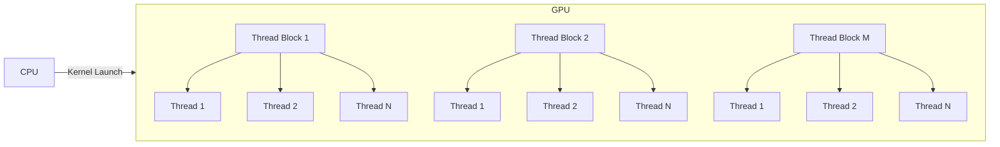
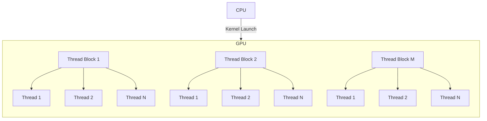

\newpage
## 4. Bevezetés a CUDA-ba

A modern számítástechnika világában a párhuzamos feldolgozás egyre nagyobb szerepet kap, hiszen a hatalmas adatmennyiségek kezelése és a komplex számítási feladatok megoldása jelentős erőforrásokat igényel. A GPU-k (Graphics Processing Units) fejlődése új lehetőségeket nyitott meg a tudományos kutatásoktól kezdve a mesterséges intelligencián át egészen a pénzügyi szimulációkig. Ezen fejlődés egyik kulcsfontosságú eleme a CUDA (Compute Unified Device Architecture), az NVIDIA által kifejlesztett párhuzamos számítási platform és programozási modell. Ez a fejezet bemutatja a GPU és a CUDA történetét, áttekinti a CUDA ökoszisztémáját és alkalmazási területeit, valamint megvizsgálja, miért érdemes CUDA-t használni a párhuzamos számítási feladatok megoldásához.

### 4.1 A GPU és a CUDA története

#### A GPU evolúciója

A grafikus feldolgozóegységek (GPU-k) története az 1980-as évek közepéig nyúlik vissza, amikor az első grafikus gyorsítókártyák megjelentek a piacon. Ezek az eszközök eredetileg kizárólag a számítógépes grafika, különösen a játékok és a professzionális vizualizációk számára készültek. Az első jelentős előrelépés a 3D grafika területén történt, amikor a vállalatok, mint az NVIDIA és az ATI (most AMD) elkezdtek dedikált 3D grafikai gyorsítókártyákat gyártani. Az 1990-es évek közepén a GPU-k képesek lettek 3D modelleket renderelni, ami forradalmasította a számítógépes játékokat és a vizuális effektusokat.

A 2000-es évek elején a GPU-k már nem csak a grafikai feladatok felgyorsítására voltak alkalmasak. Az NVIDIA bemutatta a GeForce 256-ot, amelyet az első GPU-ként tartanak számon, mivel már tartalmazott hardveres transzformációt és világítást (T&L). Ez az újítás lehetővé tette, hogy a grafikai számításokat közvetlenül a GPU végezze, csökkentve ezzel a CPU terhelését és növelve a teljesítményt.

Ahogy a GPU-k egyre bonyolultabbá váltak, egyre nyilvánvalóbbá vált, hogy a párhuzamos számítási képességeik nem csak a grafikai feladatokra használhatók. A kutatók felfedezték, hogy a GPU-k alkalmasak más típusú párhuzamos számítások végrehajtására is, például tudományos számításokra, kriptográfiára és mesterséges intelligenciára. Ez az új terület, amely a grafikai alkalmazásokon kívüli számításokat jelenti, általános célú GPU-számítások (GPGPU) néven vált ismertté.

#### CUDA kialakulása és szerepe a párhuzamos számítástechnikában

Az NVIDIA 2006-ban mutatta be a CUDA-t (Compute Unified Device Architecture), amely az első kereskedelmi forgalomban elérhető GPGPU platform volt. A CUDA célja az volt, hogy a GPU-k hatalmas párhuzamos feldolgozási képességeit könnyen hozzáférhetővé tegye a programozók számára. A CUDA segítségével a fejlesztők C, C++ és Fortran nyelveken írhatnak programokat, amelyek közvetlenül kihasználják a GPU-k párhuzamos feldolgozási képességeit.

A CUDA bevezetése óta jelentős hatással volt a párhuzamos számítástechnikára. Az egyik legfontosabb újítása az volt, hogy lehetővé tette a fejlesztők számára, hogy egyszerűen és hatékonyan írjanak programokat, amelyek a GPU-kat használják. A CUDA programozási modellje három fő komponensre épül: a párhuzamos kernel függvényekre, a szálblokkokra és a rácsokra. Ez a hierarchikus modell lehetővé teszi a programozók számára, hogy egyszerre több ezer párhuzamos szálat indítsanak el, amelyek mindegyike egy kis részfeladatot végez el.

A CUDA fejlődése során az NVIDIA folyamatosan bővítette a platform képességeit, új eszközöket és könyvtárakat biztosítva a fejlesztők számára. A CUDA Toolkit tartalmazza a szükséges fordítókat, könyvtárakat és eszközöket, amelyek segítségével a fejlesztők hatékonyan dolgozhatnak a GPU-kkal. A CUDA-támogatású GPU-k teljesítménye is folyamatosan nőtt, lehetővé téve egyre bonyolultabb és erőforrás-igényesebb alkalmazások futtatását.

A CUDA elterjedése és fejlődése nagyban hozzájárult a párhuzamos számítástechnika fejlődéséhez. Számos tudományos területen, például a bioinformatikában, a fizikában, a kémia és az orvostudomány területén használják a CUDA-t a nagy teljesítményű számítási feladatok gyorsítására. Az iparban is széles körben alkalmazzák, például a gépi tanulásban, a pénzügyi modellezésben és a játékiparban. A CUDA lehetővé tette, hogy a GPU-kat ne csak grafikai feldolgozásra, hanem általános célú párhuzamos számításokra is használják, jelentősen növelve ezzel a számítástechnikai teljesítményt és hatékonyságot.

#### Mermaid ábra: A CUDA programozási modellje

Az ábrán látható, hogy a CUDA programozási modellje hierarchikus. A CPU elindítja a kernelfüggvényt, amely a GPU-n fut. A GPU a kernelfüggvényt több szálblokkra osztja, amelyek mindegyike több szálból áll. Ez a hierarchikus felépítés lehetővé teszi a párhuzamos számítások hatékony végrehajtását, mivel a szálak egyidejűleg dolgoznak a számítási feladatokon.

#### CUDA alkalmazásai

A CUDA-t széles körben használják különféle területeken, beleértve a tudományos kutatásokat, a gépi tanulást, a kép- és jelfeldolgozást, valamint a számítógépes grafikát. Néhány konkrét példa:

1. **Tudományos kutatások**: A CUDA lehetővé teszi a nagy számítási igényű tudományos szimulációk gyorsítását, például a molekuláris dinamika, a kvantummechanika és az asztrofizika területén.
2. **Gépi tanulás**: A mély neurális hálózatok (DNN) és más gépi tanulási modellek edzése jelentős számítási kapacitást igényel. A CUDA-val rendelkező GPU-k lehetővé teszik ezeknek a modelleknek a gyorsabb betanítását.
3. **Kép- és jelfeldolgozás**: A CUDA felgyorsítja a képek és jelek feldolgozását, például a képfelismerés, a videófeldolgozás és az orvosi képek elemzése során.
4. **Számítógépes grafika**: Bár a CUDA elsősorban nem grafikai feladatokra készült, a grafikai számításokban is hasznosítható, például a valós idejű ray tracing és a fizikai szimulációk során.

A CUDA tehát egy sokoldalú és erőteljes eszköz, amely lehetővé teszi a párhuzamos számítások széles körű alkalmazását a GPU-k hatalmas teljesítményének kihasználásával.

### 4.2 Mi az a CUDA?

#### A CUDA ökoszisztéma áttekintése

A CUDA (Compute Unified Device Architecture) az NVIDIA által kifejlesztett párhuzamos számítási platform és programozási modell, amely lehetővé teszi a fejlesztők számára, hogy a GPU-kat általános célú számítási feladatokra használják. A CUDA ökoszisztéma több összetevőből áll, amelyek együttműködve biztosítják a hatékony párhuzamos számítások végrehajtását. Az alábbiakban részletesen bemutatjuk a CUDA ökoszisztémáját, beleértve a programozási modellt, a fejlesztési eszközöket és a támogató könyvtárakat.

#### A CUDA programozási modellje

A CUDA programozási modellje hierarchikus és párhuzamos struktúrára épül, amely lehetővé teszi a fejlesztők számára, hogy nagy számú szálat indítsanak el egyidejűleg. A programozási modell három fő komponensre oszlik: a kernel függvényekre, a szálblokkokra és a rácsokra.

1. **Kernel függvények**: A CUDA programok alapvető egységei a kernel függvények, amelyek a GPU-n futnak. Ezeket a függvényeket a CPU hívja meg, és a GPU több párhuzamos szálat indít el a függvény végrehajtásához.

2. **Szálblokkok**: A GPU-n futó kernel függvények szálblokkokban szerveződnek. Egy szálblokk több szálat tartalmaz, amelyek együttműködhetnek és megoszthatják az adatokat. A szálblokkok függetlenek egymástól, így a GPU különböző feldolgozóegységei különböző blokkokat végezhetnek el egyidejűleg.

3. **Rácsok**: A szálblokkok rácsokban szerveződnek, amelyek lehetővé teszik a kernel függvények nagy számú szálblokkjának indítását. A rácsok és szálblokkok hierarchikus szerkezete biztosítja a párhuzamos számítások hatékony végrehajtását.

#### Fejlesztési eszközök

A CUDA ökoszisztéma számos fejlesztési eszközt tartalmaz, amelyek segítik a programozókat a hatékony CUDA kód megírásában, optimalizálásában és hibakeresésében. Ezek közé tartoznak:

1. **CUDA Toolkit**: A CUDA Toolkit az NVIDIA által biztosított eszközkészlet, amely tartalmazza a CUDA kód fordításához és futtatásához szükséges fordítókat, könyvtárakat és fejlesztői eszközöket. A toolkit része a nvcc fordító, amely a CUDA C/C++ kódot lefordítja a GPU-n futtatható bináris állományokká.

2. **CUDA-grafikus felület**: Az NVIDIA Nsight egy fejlett fejlesztői környezet, amely integrált eszközöket biztosít a CUDA kód írásához, hibakereséséhez és profilozásához. Az Nsight lehetővé teszi a fejlesztők számára, hogy részletesen elemezzék a CUDA kód teljesítményét és optimalizálják azt.

3. **Profilozó eszközök**: A CUDA ökoszisztéma számos profilozó eszközt kínál, mint például a NVIDIA Visual Profiler és az nvprof. Ezek az eszközök segítenek a fejlesztőknek azonosítani a teljesítmény szűk keresztmetszeteit és optimalizálási lehetőségeket.

#### Támogató könyvtárak

A CUDA ökoszisztéma számos nagy teljesítményű könyvtárat tartalmaz, amelyek előre megírt és optimalizált függvényeket kínálnak különböző párhuzamos számítási feladatokhoz. Ezek a könyvtárak jelentősen megkönnyítik a fejlesztők munkáját, mivel nem kell az alapvető algoritmusokat újraírniuk és optimalizálniuk. Néhány fontosabb könyvtár:

1. **cuBLAS**: A cuBLAS könyvtár a lineáris algebrai számítások gyors végrehajtását teszi lehetővé. Tartalmaz optimalizált rutinokat, például mátrixszorzást, vektorműveleteket és mátrixinverziót.

2. **cuFFT**: A cuFFT könyvtár a gyors Fourier-transzformáció (FFT) hatékony végrehajtását biztosítja. Az FFT széles körben használt algoritmus a jelfeldolgozásban, a képfeldolgozásban és a tudományos számításokban.

3. **cuDNN**: A cuDNN könyvtár a mély neurális hálózatok (DNN) gyors végrehajtását támogatja. Tartalmaz optimalizált függvényeket a neurális hálózatok különböző rétegeinek, például konvolúciós rétegek, pooling rétegek és aktivációs függvények végrehajtásához.

4. **Thrust**: A Thrust könyvtár egy magas szintű C++ könyvtár, amely a standard template library (STL) stílusában kínál párhuzamos algoritmusokat. A Thrust lehetővé teszi a fejlesztők számára, hogy egyszerűen és hatékonyan írjanak párhuzamos kódot a CUDA platformon.

#### CUDA használati esetei

A CUDA számos területen hasznosítható, ahol nagy teljesítményű párhuzamos számításokra van szükség. Az alábbiakban néhány példa látható a CUDA gyakorlati alkalmazásaira.

1. **Tudományos számítások**: A CUDA jelentősen felgyorsíthatja a tudományos számításokat, például a molekuláris dinamika szimulációkat, az áramlástani szimulációkat és a kvantummechanikai számításokat. A GPU-k párhuzamos feldolgozási képességei lehetővé teszik a nagy számítási igényű feladatok gyors végrehajtását, csökkentve ezzel a szimulációk futási idejét.

2. **Mesterséges intelligencia és gépi tanulás**: A CUDA alapú GPU-k elengedhetetlenek a mély neurális hálózatok (DNN) és más gépi tanulási modellek edzéséhez. A GPU-k párhuzamos feldolgozási képességei lehetővé teszik a modellek gyorsabb betanítását, ami különösen fontos a nagy adatkészletek és a bonyolult hálózati architektúrák esetében.

3. **Kép- és jelfeldolgozás**: A CUDA alkalmazása a kép- és jelfeldolgozásban lehetővé teszi a nagy felbontású képek és jelek gyors elemzését és feldolgozását. Például az orvosi képfeldolgozásban a CUDA alapú algoritmusok felgyorsíthatják a CT és MRI képek rekonstrukcióját és elemzését, javítva ezzel a diagnosztikai folyamatok hatékonyságát.

4. **Pénzügyi szimulációk**: A pénzügyi iparban a CUDA alkalmazása lehetővé teszi a komplex pénzügyi modellek és szimulációk gyors végrehajtását. A GPU-k párhuzamos feldolgozási képességei lehetővé teszik a nagy számú Monte Carlo szimuláció és más pénzügyi algoritmusok hatékony végrehajtását, csökkentve ezzel a kockázatelemzés és portfóliókezelés futási idejét.

5. **Számítógépes grafika és vizualizáció**: A CUDA használata a számítógépes grafikában lehetővé teszi a valós idejű renderelést és a fizikai szimulációk gyors végrehajtását. Például a valós idejű ray tracing technológia segítségével a GPU-k lehetővé teszik a fotorealisztikus képek gyors renderelését, ami különösen fontos a játékfejlesztés és a vizuális effektusok területén.

A CUDA tehát egy rendkívül sokoldalú és erőteljes eszköz, amely lehetővé teszi a fejlesztők számára, hogy a GPU-k párhuzamos feldolgozási képességeit kihasználva jelentősen felgyorsítsák a számítási feladatokat. Az ökoszisztéma részeként rendelkezésre álló fejlesztési eszközök és támogató könyvtárak biztosítják, hogy a fejlesztők hatékonyan és eredményesen dolgozhassanak a CUDA platformon.

### 4.3 Miért használjunk CUDA-t?

A CUDA (Compute Unified Device Architecture) használatának számos előnye van a párhuzamos számítások terén. Az alábbi fejezet részletesen bemutatja a CUDA előnyeit és hátrányait, valamint azt, hogy miért érdemes ezt a platformot választani a nagy teljesítményű számítási feladatokhoz.

#### CUDA előnyei

1. **Hatalmas párhuzamos feldolgozási képesség**: A CUDA egyik legnagyobb előnye a GPU-k hatalmas párhuzamos feldolgozási képessége. Egy modern GPU több ezer párhuzamos szálat képes futtatni egyszerre, ami lehetővé teszi a nagy számítási igényű feladatok gyors végrehajtását. A CUDA segítségével a fejlesztők könnyedén írhatnak kódot, amely kihasználja ezt a párhuzamos feldolgozási teljesítményt.

2. **Széleskörű ökoszisztéma**: Az NVIDIA CUDA ökoszisztémája rendkívül gazdag és jól támogatott. A CUDA Toolkit számos eszközt és könyvtárat tartalmaz, amelyek megkönnyítik a fejlesztést, a hibakeresést és az optimalizálást. Emellett a CUDA közösség aktív és sok forrást biztosít a tanuláshoz és a problémamegoldáshoz.

3. **Könnyű programozás**: A CUDA programozási modellje intuitív és könnyen megtanulható. A CUDA C/C++ programozási nyelvek hasonlítanak a hagyományos C/C++ nyelvekhez, így a fejlesztők gyorsan elsajátíthatják a CUDA használatát. A hierarchikus programozási modell lehetővé teszi a fejlesztők számára, hogy egyszerűen szervezzék és kezeljék a párhuzamos szálakat.

4. **Optimalizált könyvtárak**: A CUDA számos előre megírt és optimalizált könyvtárat kínál, amelyek gyorsítják a fejlesztést és a teljesítményt. Például a cuBLAS, cuFFT és cuDNN könyvtárak lehetővé teszik a fejlesztők számára, hogy gyorsan és hatékonyan végezzenek el bonyolult számításokat, anélkül hogy az alapvető algoritmusokat újra kellene írniuk.

5. **Széleskörű alkalmazási lehetőségek**: A CUDA számos különböző területen alkalmazható, beleértve a tudományos kutatásokat, a gépi tanulást, a kép- és jelfeldolgozást, valamint a számítógépes grafikát. Ez a sokoldalúság teszi a CUDA-t kiváló választássá a fejlesztők számára, akik nagy teljesítményű számítási feladatokat szeretnének végrehajtani.

6. **Skálázhatóság**: A CUDA programok könnyen skálázhatók a különböző GPU architektúrákra és konfigurációkra. A fejlesztők egyszer megírhatják a CUDA kódot, és az különböző NVIDIA GPU-kon is futtatható, legyen szó asztali gépről, szerverről vagy szuperszámítógépről. Ez a skálázhatóság különösen fontos a nagy teljesítményű számítástechnikai (HPC) alkalmazásokban.

#### CUDA hátrányai

1. **NVIDIA-specifikus**: A CUDA kizárólag az NVIDIA GPU-kkal kompatibilis, így a fejlesztők csak az NVIDIA hardverén használhatják. Ez egyes esetekben hátrány lehet, ha a projekt más GPU gyártók eszközeit is támogatni kívánja.

2. **Meredek tanulási görbe**: Bár a CUDA programozási modellje viszonylag könnyen elsajátítható, a párhuzamos programozás általában meredek tanulási görbével jár. A fejlesztőknek meg kell érteniük a párhuzamos számítási koncepciókat és a GPU architektúra sajátosságait, hogy hatékonyan használhassák a CUDA-t.

3. **Optimalizálási kihívások**: A CUDA programok optimalizálása bonyolult lehet, mivel a fejlesztőknek figyelembe kell venniük a GPU architektúra különböző aspektusait, mint például a memóriahierarchiát, a szálak szinkronizálását és a számítási erőforrások hatékony kihasználását. Az optimalizálás jelentős időt és tapasztalatot igényelhet.

4. **Eszközigény**: A CUDA fejlesztéshez megfelelő NVIDIA GPU-k szükségesek, amelyek általában drágábbak lehetnek, mint a CPU-k vagy más GPU-k. Emellett a fejlesztőknek rendelkezniük kell a szükséges hardverrel és szoftverrel a CUDA kód teszteléséhez és futtatásához.

#### CUDA alkalmazási területek

A CUDA széles körben alkalmazható különböző iparágakban és tudományos területeken. Az alábbiakban néhány példa látható a CUDA gyakorlati alkalmazásaira.

1. **Tudományos kutatások**: A CUDA lehetővé teszi a nagy számítási igényű tudományos szimulációk gyorsítását. Például a molekuláris dinamika szimulációk, az áramlástani szimulációk és a kvantummechanikai számítások jelentősen felgyorsíthatók a GPU-k párhuzamos feldolgozási képességeinek kihasználásával.

2. **Mesterséges intelligencia és gépi tanulás**: A CUDA elengedhetetlen a mély neurális hálózatok (DNN) és más gépi tanulási modellek betanításához és futtatásához. A GPU-k párhuzamos feldolgozási képességei lehetővé teszik a modellek gyorsabb betanítását és a nagy adatkészletek hatékony feldolgozását.

3. **Kép- és jelfeldolgozás**: A CUDA használata a kép- és jelfeldolgozásban lehetővé teszi a nagy felbontású képek és jelek gyors elemzését és feldolgozását. Például az orvosi képfeldolgozásban a CUDA alapú algoritmusok felgyorsíthatják a CT és MRI képek rekonstrukcióját és elemzését, javítva ezzel a diagnosztikai folyamatok hatékonyságát.

4. **Pénzügyi szimulációk**: A CUDA alkalmazása a pénzügyi iparban lehetővé teszi a komplex pénzügyi modellek és szimulációk gyors végrehajtását. A GPU-k párhuzamos feldolgozási képességei lehetővé teszik a nagy számú Monte Carlo szimuláció és más pénzügyi algoritmusok hatékony végrehajtását, csökkentve ezzel a kockázatelemzés és portfóliókezelés futási idejét.

5. **Számítógépes grafika és vizualizáció**: A CUDA használata a számítógépes grafikában lehetővé teszi a valós idejű renderelést és a fizikai szimulációk gyors végrehajtását. Például a valós idejű ray tracing technológia segítségével a GPU-k lehetővé teszik a fotorealisztikus képek gyors renderelését, ami különösen fontos a játékfejlesztés és a vizuális effektusok területén.

#### Táblázat: CUDA előnyei és hátrányai

| Előnyök                             | Hátrányok                         |
|-------------------------------------|-----------------------------------|
| Hatalmas párhuzamos feldolgozási képesség | NVIDIA-specifikus                 |
| Széleskörű ökoszisztéma             | Meredek tanulási görbe             |
| Könnyű programozás                  | Optimalizálási kihívások           |
| Optimalizált könyvtárak             | Eszközigény                       |
| Széleskörű alkalmazási lehetőségek  |                                   |
| Skálázhatóság                       |                                   |

#### Összefoglalás

A CUDA egy rendkívül sokoldalú és erőteljes platform a párhuzamos számításokhoz, amely lehetővé teszi a fejlesztők számára, hogy a GPU-k hatalmas párhuzamos feldolgozási képességeit kihasználva jelentősen felgyorsítsák a számítási feladatokat. A CUDA ökoszisztéma gazdag eszközökben és könyvtárakban, amelyek megkönnyítik a fejlesztést, a hibakeresést és az optimalizálást. Bár a CUDA használata bizonyos kihívásokkal jár, mint például a meredek tanulási görbe és az optimalizálási nehézségek, az előnyök messze felülmúlják ezeket a hátrányokat. A CUDA széles körben alkalmazható különböző iparágakban és tudományos területeken, ami kiváló választássá teszi a nagy teljesítményű számítástechnikai feladatokhoz.