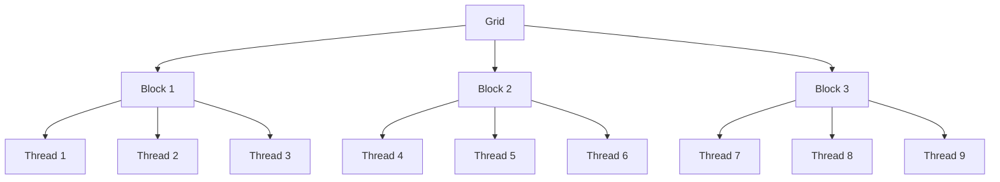
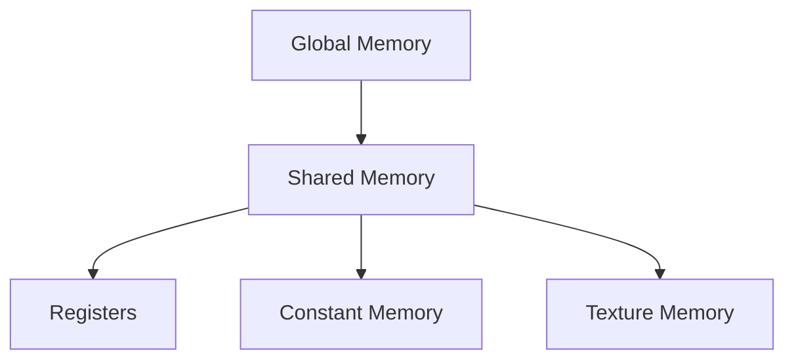
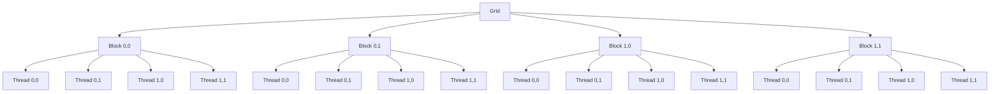
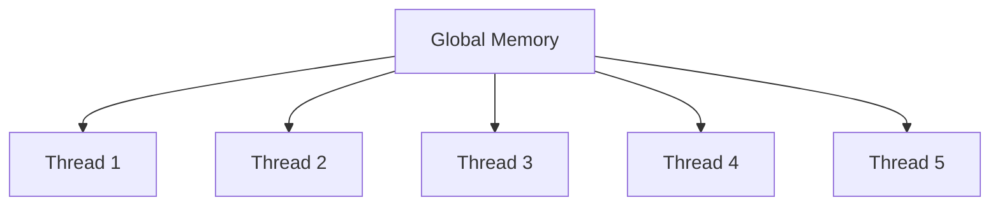

\newpage

## 5. CUDA Architektúra és Programozási Modell

A CUDA (Compute Unified Device Architecture) az NVIDIA által kifejlesztett platform és programozási modell, amely lehetővé teszi a grafikus feldolgozó egységek (GPU-k) általános célú számítási feladatokra való felhasználását. Ez a fejezet bemutatja a CUDA architektúrájának alapvető elemeit és programozási modelljét, amelyek révén a fejlesztők hatékonyan kihasználhatják a GPU-k párhuzamos feldolgozási képességeit. Az első alfejezetben áttekintést nyújtunk a CUDA architektúra legfontosabb komponenseiről, mint a streaming multiprocesszorok (SM-ek), szálak (threads) és hálózatok (grids). A következő részben részletesen foglalkozunk a szálhierarchiával, a szálak, blokkok és rácsok konfigurációjának tervezésével, melyek a hatékony párhuzamos programozás alapjai. Végül bemutatjuk a CUDA memória hierarchiáját, ideértve a globális, megosztott, regiszter és speciális memória típusokat, amelyek megfelelő használata kulcsfontosságú a teljesítmény optimalizálásában.

### 5.1 CUDA Architektúra Áttekintése

A CUDA architektúra a párhuzamos számítási feladatok hatékony végrehajtására lett tervezve, lehetővé téve a GPU-k (Graphics Processing Units) számítási teljesítményének kihasználását a hagyományos CPU-khoz képest. Ez az alfejezet részletesen bemutatja a CUDA architektúra legfontosabb komponenseit, beleértve a streaming multiprocesszorokat (SM-ek), a szálakat (threads) és a hálózatokat (grids), valamint azok szerepét a párhuzamos feldolgozásban.

#### Streaming Multiprocessors (SM-ek)

A CUDA architektúra alapvető építőkövei a Streaming Multiprocessorok (SM-ek), amelyek egy GPU több száz vagy akár több ezer magját (cores) foglalják magukban. Minden SM egy független feldolgozóegység, amely képes párhuzamosan végrehajtani a szálakat (threads). Az SM-ek számos komponensből állnak, beleértve a regisztereket, a megosztott memóriát, a warp ütemezőt és a különféle speciális funkcionális egységeket (pl. aritmetikai logikai egységek, load/store egységek).

#### Szálak (Threads) és Hálózatok (Grids)

A CUDA programozási modellben a párhuzamos számítási feladatok szálak (threads) formájában kerülnek végrehajtásra. Ezek a szálak blokkokba (blocks) vannak csoportosítva, amelyek viszont hálózatokat (grids) alkotnak. Az egyes szálak egyedi azonosítókkal rendelkeznek, amelyek segítségével meghatározhatják saját pozíciójukat a blokkon belül és a teljes hálózatban. Ez a hierarchikus szerveződés lehetővé teszi a párhuzamos programozás egyszerűbb és strukturáltabb megközelítését.

##### Szálhierarchia (Thread, Block, Grid)

A szálhierarchia három szintből áll:
1. **Szál (Thread)**: A legkisebb végrehajtási egység, amely egy adott műveletet hajt végre.
2. **Blokk (Block)**: Egy szálakból álló csoport, amelyek egy közös megosztott memóriát használnak és egy SM-en futnak.
3. **Hálózat (Grid)**: Blokkok gyűjteménye, amely egy kernel indítása során jön létre. Minden blokk függetlenül végrehajtható.



##### Szálkonfigurációk Tervezése

A hatékony CUDA programozás egyik kulcsa a megfelelő szálkonfigurációk tervezése. A szálak száma és elosztása jelentős hatással van a program teljesítményére. A következő tényezőket kell figyelembe venni:
- **Blokkok mérete**: A blokkok méretének (szálak száma blokkonként) optimalizálása kritikus a memóriahasználat és a végrehajtási idő szempontjából.
- **Szálak elosztása**: A szálak elosztása befolyásolja az adat-hozzáférési mintákat és a memória-sávszélességet.

#### Memória Hierarchia

A CUDA architektúra memória hierarchiája különböző típusú memóriákból áll, amelyek eltérő hozzáférési sebességgel és kapacitással rendelkeznek. A hatékony memóriahasználat kulcsfontosságú a program teljesítményének optimalizálásában.

##### Globális Memória

A globális memória a GPU fő memóriája, amely minden szál számára elérhető, de a hozzáférés lassabb, mint a többi memória típusé. A globális memória használatakor fontos figyelni az adatok elrendezésére és az együttese hozzáférés optimalizálására, hogy minimalizáljuk a memória késleltetést.

##### Megosztott Memória

A megosztott memória egy gyorsabb, de kisebb kapacitású memória típus, amely egy blokk összes szála számára közös. Az SM-en belüli megosztott memória hozzáférés jelentősen gyorsabb, mint a globális memória hozzáférés, így érdemes az adatokat ideiglenesen itt tárolni, ha több szál is hozzáfér ugyanahhoz az adathoz.

##### Regiszterek

A regiszterek a leggyorsabb memória típus, amelyeket minden szál külön használ. A regiszterek száma korlátozott, így fontos optimalizálni a használatukat a maximális teljesítmény elérése érdekében.

##### Konstans és Textúra Memória

A konstans és textúra memória speciális típusú memóriák, amelyek különleges hozzáférési mintákat támogatnak. A konstans memória gyors hozzáférést biztosít az állandó adatokhoz, míg a textúra memória optimalizált a képek és más térbeli adatok kezelésére.



A CUDA architektúra és programozási modell mély megértése alapvető fontosságú a hatékony párhuzamos számítási feladatok megvalósításához. Az SM-ek, szálak, blokkok és hálózatok, valamint a memória hierarchia megfelelő használata lehetővé teszi a fejlesztők számára, hogy maximálisan kihasználják a GPU-k párhuzamos feldolgozási képességeit.

### 5.2 Szálak, Blokkok és Rácsok

A CUDA programozási modell alapvető elemei a szálak (threads), blokkok (blocks) és rácsok (grids), amelyek hierarchikus struktúrában szerveződnek. Ez a fejezet részletesen bemutatja e három komponens szerepét és működését, valamint a szálkonfigurációk tervezésének szempontjait, amelyek elengedhetetlenek a hatékony párhuzamos számítási feladatok végrehajtásához.

#### Szálak (Threads)

A szál a legkisebb végrehajtási egység a CUDA programozási modellben. Minden szál egy kernelkód egy példányát hajtja végre, és rendelkezik saját regiszterekkel és helyi memóriával. A szálak párhuzamosan futnak, és egymástól függetlenül végzik a számításokat, ami lehetővé teszi a nagy számú szálak egyidejű futtatását. A szálak azonosítóval (thread ID) rendelkeznek, amely alapján meghatározhatják saját pozíciójukat a blokkon belül.

#### Blokkok (Blocks)

A blokkok szálak csoportjai, amelyek egy közös megosztott memóriát használnak és egy SM-en futnak. Minden blokk egyedi azonosítóval (block ID) rendelkezik, és a szálak azonosítói (thread ID) és a blokk azonosítók (block ID) kombinációja alapján határozható meg egy szál pontos helye a teljes rácson belül. A blokkok közötti szinkronizáció korlátozott, így a blokkok függetlenül végrehajthatók, ami növeli a skálázhatóságot.

A blokkok méretét és alakját a programozónak kell meghatároznia, figyelembe véve a GPU architektúráját és a feladat jellegét. Az optimális blokk méret biztosítja a magasabb kihasználtságot és a hatékonyabb memória hozzáférést.

#### Rácsok (Grids)

A rács a CUDA programozási modell legmagasabb szintű szerveződési egysége, amely blokkokból áll. Minden kernelindítás egy rácsot hoz létre, amely meghatározza a végrehajtandó blokkok számát és elrendezését. A rácsok lehetnek egy- vagy többdimenziósak, ami rugalmasságot biztosít a különböző típusú problémákhoz. A rácsok lehetővé teszik a nagy számítási feladatok egyszerű felosztását és párhuzamosítását.



#### Szálhierarchia

A szálhierarchia három szintje - szálak, blokkok és rácsok - lehetővé teszi a különböző számítási feladatok hatékony párhuzamosítását. Az alábbiakban részletesen bemutatjuk a szálhierarchia működését:

1. **Szálak**: A legkisebb végrehajtási egységek, amelyek függetlenül hajtanak végre számításokat.
2. **Blokkok**: Szálak csoportjai, amelyek egy közös megosztott memóriát használnak és egy SM-en futnak. A blokkok mérete és elrendezése befolyásolja a teljesítményt.
3. **Rácsok**: Blokkok csoportjai, amelyek meghatározzák a teljes végrehajtási feladatot. A rácsok lehetnek egy- vagy többdimenziósak, és az elrendezésük optimalizálása fontos a hatékonyság szempontjából.

#### Szálkonfigurációk Tervezése

A szálkonfigurációk tervezése kritikus szerepet játszik a CUDA programok hatékonyságában. A következő tényezőket kell figyelembe venni:

- **Blokkméret**: Az optimális blokkméret meghatározása fontos a memóriahasználat és a számítási teljesítmény szempontjából. Az általánosan javasolt blokkméret 128 és 512 szál között van.
- **Szálak elrendezése**: A szálak elrendezése befolyásolja az adat-hozzáférési mintákat és a memória-sávszélességet. Az együttese memóriahozzáférés optimalizálása csökkentheti a késleltetést és növelheti a sávszélességet.
- **Szinkronizáció**: A szálak közötti szinkronizáció fontos a koherencia biztosítása érdekében, különösen a megosztott memória használatakor. A szinkronizáció túlzott használata azonban csökkentheti a teljesítményt, ezért csak szükség esetén alkalmazzuk.

#### Példa Szálkonfigurációra

Tekintsünk egy példát, ahol egy kétdimenziós mátrixon végzünk számításokat. Az alábbi kód bemutatja, hogyan definiáljuk a szálak, blokkok és rácsok konfigurációját egy egyszerű kernel indításakor:

```cpp
__global__ void matrixKernel(float* matrix, int width, int height) {
    int x = blockIdx.x * blockDim.x + threadIdx.x;
    int y = blockIdx.y * blockDim.y + threadIdx.y;
    
    if (x < width && y < height) {
        int index = y * width + x;
        // Végezzen el valamilyen számítást a matrix[index] elemen
    }
}

int main() {
    int width = 1024;
    int height = 1024;
    float* d_matrix;

    // Memória foglalás és adatmásolás a GPU-ra

    dim3 threadsPerBlock(16, 16);
    dim3 numBlocks((width + threadsPerBlock.x - 1) / threadsPerBlock.x,
                   (height + threadsPerBlock.y - 1) / threadsPerBlock.y);

    matrixKernel<<<numBlocks, threadsPerBlock>>>(d_matrix, width, height);

    // Eredmények visszamásolása és memória felszabadítása

    return 0;
}
```

Ebben a példában a `threadsPerBlock` dim3 struktúra meghatározza, hogy minden blokk 16x16 szálból áll, míg a `numBlocks` struktúra meghatározza, hogy hány blokkra van szükség a teljes mátrix lefedéséhez. Ez a konfiguráció lehetővé teszi a teljes mátrix hatékony párhuzamos feldolgozását.

#### Szinkronizáció és Szálbiztonság

A szálak közötti szinkronizáció biztosítása kulcsfontosságú a párhuzamos programozásban. A CUDA programozási modell számos szinkronizációs eszközt kínál, beleértve a blokk szintű szinkronizációt (`__syncthreads()`), amely lehetővé teszi a szálak közötti adatmegosztás koordinálását egy blokkban. Ezen kívül a memóriaelérések sorrendjének biztosítása érdekében atomikus műveletek is használhatók, mint például az `atomicAdd()`.

#### Összefoglalás

A szálak, blokkok és rácsok hierarchikus szervezése a CUDA programozási modell egyik legfontosabb jellemzője. A megfelelő szálkonfigurációk tervezése és a memóriahasználat optimalizálása kulcsfontosságú a hatékony párhuzamos számítási feladatok végrehajtásában. Az SM-ek, szálak, blokkok és rácsok együttese lehetővé teszi a fejlesztők számára, hogy maximálisan kihasználják a GPU-k párhuzamos feldolgozási képességeit, és ezzel jelentős teljesítményelőnyt érjenek el a hagyományos CPU-alapú számításokkal szemben.

### 5.3 Memória Hierarchia

A CUDA architektúra egyik legfontosabb aspektusa a memória hierarchia, amely lehetővé teszi a hatékony adatkezelést és párhuzamos feldolgozást. A különböző memória típusok eltérő sebességgel és kapacitással rendelkeznek, ezért a megfelelő memóriahasználat kulcsfontosságú a programok teljesítményének optimalizálásához. Ebben az alfejezetben részletesen bemutatjuk a globális memóriát, a megosztott memóriát, a regisztereket, valamint a konstans és textúra memóriát.

#### Globális Memória

A globális memória a CUDA memória hierarchia legnagyobb és leglassabb része, amely a GPU fő memóriáját jelenti. Minden szál hozzáférhet a globális memóriához, de a hozzáférési késleltetés magas, így a hatékony használat érdekében fontos figyelni az adatok elrendezésére és a memória-hozzáférési mintákra.

##### Adatok Elrendezése

Az adatok elrendezése a globális memóriában jelentős hatással van a memória-hozzáférési teljesítményre. Az optimális teljesítmény érdekében az adatoknak együtt kell lenniük, hogy a memória hozzáférések koaleszkáljanak. A koaleszkált memóriahozzáférés lehetővé teszi, hogy több szál egyidejűleg hozzáférjen az adatokhoz egyetlen memória tranzakcióval, csökkentve ezzel a késleltetést.



##### Példa Koaleszkált Hozzáférésre

Tekintsünk egy példát, ahol egy tömb elemeit szeretnénk feldolgozni. Az optimális teljesítmény érdekében a tömb elemeit úgy kell elrendezni, hogy a szálak memóriahozzáférése koaleszkált legyen:

```cpp
__global__ void vectorAdd(float *A, float *B, float *C, int N) {
    int idx = blockIdx.x * blockDim.x + threadIdx.x;
    if (idx < N) {
        C[idx] = A[idx] + B[idx];
    }
}

int main() {
    int N = 1024;
    float *d_A, *d_B, *d_C;

    // Memória foglalás és adatmásolás a GPU-ra

    dim3 threadsPerBlock(256);
    dim3 numBlocks((N + threadsPerBlock.x - 1) / threadsPerBlock.x);

    vectorAdd<<<numBlocks, threadsPerBlock>>>(d_A, d_B, d_C, N);

    // Eredmények visszamásolása és memória felszabadítása

    return 0;
}
```

Ebben a példában az `A`, `B` és `C` tömbök elemei koaleszkáltan kerülnek elérésre, mivel a szálak szekvenciálisan hozzáférnek az elemekhez.

#### Megosztott Memória

A megosztott memória egy gyors, de kisebb kapacitású memória típus, amely egy blokk összes szála számára közös. Az SM-en belüli megosztott memória hozzáférés jelentősen gyorsabb, mint a globális memória hozzáférés, így érdemes az adatokat ideiglenesen itt tárolni, ha több szál is hozzáfér ugyanahhoz az adathoz.

##### Megosztott Memória Használata

A megosztott memória használatával optimalizálható a párhuzamos programok teljesítménye. Az alábbi példa bemutatja, hogyan lehet a megosztott memóriát használni egy mátrix szorzás során:

```cpp
__global__ void matrixMul(float *A, float *B, float *C, int N) {
    __shared__ float sharedA[16][16];
    __shared__ float sharedB[16][16];

    int tx = threadIdx.x;
    int ty = threadIdx.y;
    int bx = blockIdx.x;
    int by = blockIdx.y;

    float sum = 0.0;

    for (int i = 0; i < N / 16; ++i) {
        sharedA[ty][tx] = A[by * 16 * N + i * 16 + ty * N + tx];
        sharedB[ty][tx] = B[(i * 16 + ty) * N + bx * 16 + tx];
        __syncthreads();

        for (int k = 0; k < 16; ++k) {
            sum += sharedA[ty][k] * sharedB[k][tx];
        }
        __syncthreads();
    }

    C[by * 16 * N + bx * 16 + ty * N + tx] = sum;
}

int main() {
    int N = 1024;
    float *d_A, *d_B, *d_C;

    // Memória foglalás és adatmásolás a GPU-ra

    dim3 threadsPerBlock(16, 16);
    dim3 numBlocks(N / 16, N / 16);

    matrixMul<<<numBlocks, threadsPerBlock>>>(d_A, d_B, d_C, N);

    // Eredmények visszamásolása és memória felszabadítása

    return 0;
}
```

Ebben a példában a megosztott memóriát használjuk az `A` és `B` mátrixok részeinek ideiglenes tárolására, ami jelentősen csökkenti a globális memória hozzáférések számát és növeli a teljesítményt.

#### Regiszterek

A regiszterek a leggyorsabb memória típus, amelyeket minden szál külön használ. A regiszterek közvetlenül az SM belsejében találhatók, és hozzáférési sebességük rendkívül gyors. Azonban a regiszterek száma korlátozott, így fontos optimalizálni a használatukat.

##### Regiszternyomás

A regiszternyomás akkor lép fel, amikor egy kernel több regisztert igényel, mint amennyi elérhető egy SM-en. Ez a kernel teljesítményének csökkenéséhez vezethet, mivel a szálak végrehajtása közben a regiszterek átváltása szükséges. A regiszterhasználat optimalizálása érdekében a programozóknak minimalizálniuk kell a kernelben használt regiszterek számát.

#### Konstans és Textúra Memória

A konstans és textúra memória speciális típusú memóriák, amelyek különleges hozzáférési mintákat támogatnak.

##### Konstans Memória

A konstans memória gyors hozzáférést biztosít az állandó adatokhoz, amelyeket a kernel futása során nem módosítanak. A konstans memória optimális olvasási teljesítményt nyújt, ha az összes szál egyszerre hozzáfér ugyanahhoz az adatcímhez.

##### Textúra Memória

A textúra memória optimalizált a képek és más térbeli adatok kezelésére. A textúra memória különleges hardveres gyorsításokat kínál, amelyek lehetővé teszik a hatékony interpolációt és térbeli mintavételezést. A textúra memória különösen hasznos a grafikai és képfeldolgozási alkalmazásokban.

#### Memória Hierarchia Összefoglalás

A CUDA memória hierarchia különböző szintjei és típusai lehetővé teszik a hatékony adatkezelést és a párhuzamos számítási feladatok optimalizálását. Az alábbi táblázat összefoglalja a különböző memória típusokat és azok jellemzőit:

| Memória Típus       | Hozzáférési Idő  | Méret              | Hozzáférés Típusa   | Megjegyzés                          |
|---------------------|------------------|--------------------|---------------------|-------------------------------------|
| Globális Memória    | Lassú            | Nagy (GB)          | Szálak közötti      | Lassú, de nagy kapacitású           |
| Megosztott Memória  | Gyors            | Kicsi (KB)         | Blokkon belüli      | Gyors, de korlátozott kapacitású    |
| Regiszterek         | Nagyon gyors     | Nagyon kicsi (B)   | Szálon belüli       | Leggyorsabb, de nagyon korlátozott  |
| Konstans Memória    | Gyors            | Kicsi (KB)         | Szálak közötti      | Gyors olvasás, állandó adatokhoz    |
| Textúra Memória     | Gyors            | Kicsi/Nagy (KB/MB) | Szálak közötti      | Optimalizált térbeli adatokhoz      |

A memória hierarchia megértése és megfelelő használata kulcsfontosságú a CUDA programok teljesítményének optimalizálásában. A fejlesztőknek figyelembe kell venniük a különböző memória típusok előnyeit és korlátait, hogy hatékonyan kihasználhassák a GPU párhuzamos feldolgozási képességeit.