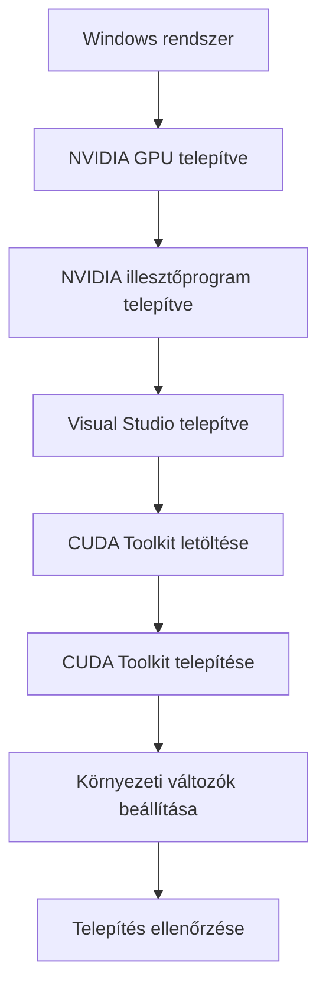
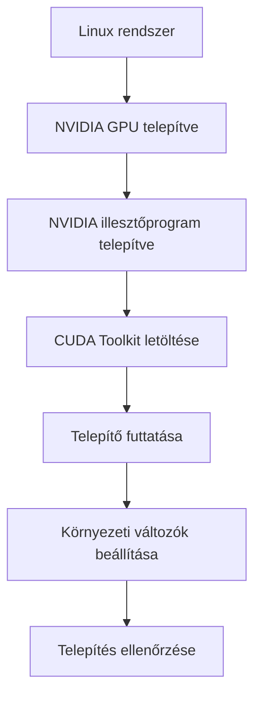
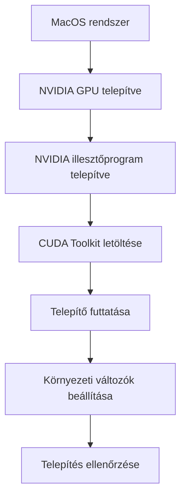
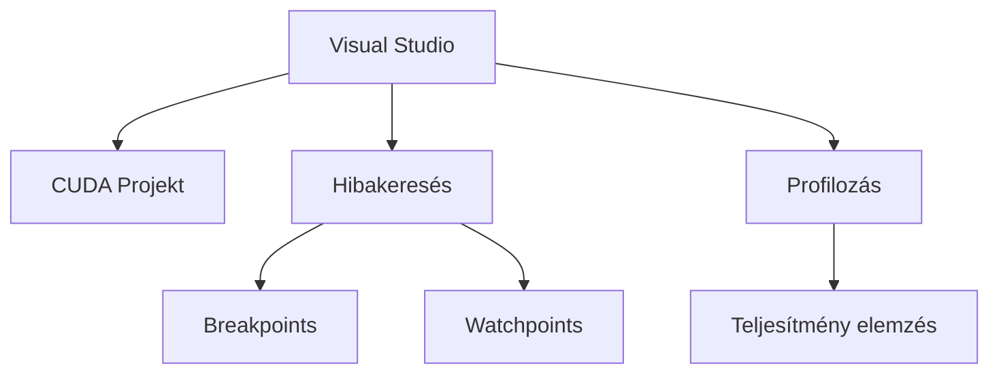
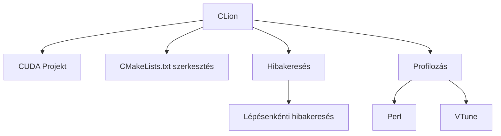
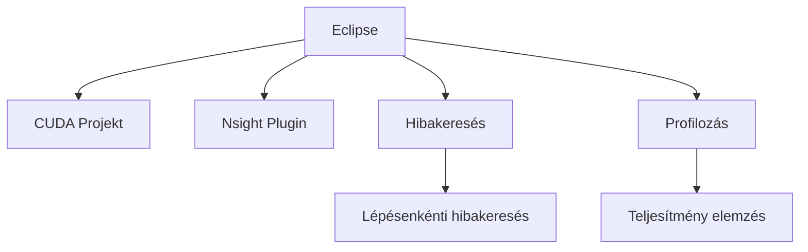

\newpage

## 6. Fejlesztőkörnyezet Beállítása

Ebben a fejezetben bemutatjuk, hogyan állítható be a fejlesztőkörnyezet a CUDA-alapú általános célú számításokhoz (GPGPU). A megfelelő eszközök és szoftverek telepítése nélkülözhetetlen ahhoz, hogy hatékonyan dolgozhassunk a GPU-k kihasználásán alapuló alkalmazásokkal. Először a CUDA Toolkit telepítésének lépéseit ismertetjük különböző operációs rendszereken, mint a Windows, Linux és MacOS. Ezt követően áttekintjük azokat az integrált fejlesztőkörnyezeteket (IDE-ket) és eszközöket, amelyek megkönnyítik a CUDA fejlesztést, beleértve a Visual Studio-t, Nsight-ot, CLion-t és Eclipse-t. Végül egy egyszerű "Hello World" program megírásán és futtatásán keresztül vezetjük végig az olvasót, részletes magyarázatokkal kiegészítve, hogy megértse a CUDA programozás alapjait.

### 6.1 CUDA Toolkit telepítése

A CUDA Toolkit telepítése a GPGPU programozás első lépése. A CUDA (Compute Unified Device Architecture) az NVIDIA által kifejlesztett platform és programozási modell, amely lehetővé teszi a fejlesztők számára, hogy a GPU-k erejét kihasználva gyorsítsák fel a számításigényes alkalmazásokat. Ebben az alfejezetben részletesen bemutatjuk, hogyan telepíthetjük a CUDA Toolkit-et a három fő operációs rendszerre: Windows, Linux és MacOS. Mielőtt azonban belekezdünk a telepítési folyamatokba, fontos megérteni a CUDA Toolkit néhány alapvető összetevőjét.

#### CUDA Toolkit összetevői

A CUDA Toolkit több komponenst tartalmaz, amelyek mind szükségesek a CUDA alkalmazások fejlesztéséhez:

- **CUDA Compiler (nvcc)**: Fordító, amely a CUDA kódot lefordítja.
- **CUDA Libraries**: Számos könyvtár, amelyek előre megírt funkciókat és algoritmusokat tartalmaznak, mint például a cuBLAS, cuFFT, cuDNN, stb.
- **CUDA Samples**: Példaprogramok, amelyek bemutatják a CUDA különböző funkcióit és felhasználási módjait.
- **CUDA Profiler (nvprof)**: Profilozó eszköz, amely segít az alkalmazások teljesítményének optimalizálásában.
- **CUDA-GDB**: Debugger eszköz, amely lehetővé teszi a CUDA alkalmazások hibakeresését.

#### CUDA Toolkit telepítése Windows rendszeren

A CUDA Toolkit Windows rendszeren történő telepítéséhez kövesse az alábbi lépéseket:

1. **Előfeltételek ellenőrzése**:
    - Győződjön meg arról, hogy rendelkezik egy NVIDIA GPU-val, amely támogatja a CUDA-t.
    - Telepítve van a legfrissebb NVIDIA illesztőprogram.
    - A Windows 10 vagy újabb operációs rendszer fut a számítógépen.
    - Visual Studio 2017 vagy újabb verzió telepítve van.

2. **CUDA Toolkit letöltése**:
    - Látogasson el az NVIDIA CUDA Toolkit letöltési oldalára: [CUDA Toolkit Download](https://developer.nvidia.com/cuda-downloads).
    - Válassza ki az operációs rendszert, a platformot és az architektúrát.
    - Töltse le a megfelelő telepítőt.

3. **CUDA Toolkit telepítése**:
    - Futtassa a letöltött telepítőt.
    - Kövesse a telepítő utasításait, válassza ki az alapértelmezett opciókat, és fejezze be a telepítést.

4. **Környezet beállítása**:
    - A telepítés után állítsa be a környezeti változókat. Adja hozzá a CUDA Toolkit bin könyvtárát a PATH környezeti változóhoz.
    - Például: `C:\Program Files\NVIDIA GPU Computing Toolkit\CUDA\v11.4\bin`.

5. **Telepítés ellenőrzése**:
    - Nyisson meg egy parancssort, és futtassa az `nvcc --version` parancsot, hogy ellenőrizze a telepítést.



#### CUDA Toolkit telepítése Linux rendszeren

A CUDA Toolkit Linux rendszeren történő telepítése némileg eltér a Windowstól, de a folyamat hasonlóan egyszerű. Az alábbiakban bemutatjuk a telepítési folyamatot Ubuntu disztribúción:

1. **Előfeltételek ellenőrzése**:
    - Győződjön meg arról, hogy rendelkezik egy NVIDIA GPU-val, amely támogatja a CUDA-t.
    - Telepítve van a legfrissebb NVIDIA illesztőprogram.
    - Ubuntu 18.04 vagy újabb operációs rendszer fut a számítógépen.

2. **CUDA Toolkit letöltése**:
    - Látogasson el az NVIDIA CUDA Toolkit letöltési oldalára: [CUDA Toolkit Download](https://developer.nvidia.com/cuda-downloads).
    - Válassza ki az operációs rendszert, a platformot és az architektúrát.
    - Töltse le a megfelelő telepítőt.

3. **CUDA Toolkit telepítése**:
    - Nyisson meg egy terminált, és navigáljon a letöltött fájlhoz.
    - Tegye futtathatóvá a telepítőt: `chmod +x cuda_<version>_linux.run`.
    - Futtassa a telepítőt: `sudo ./cuda_<version>_linux.run`.

4. **Környezet beállítása**:
    - Adja hozzá a CUDA Toolkit bin könyvtárát a PATH környezeti változóhoz. Ehhez szerkessze a `~/.bashrc` fájlt:
    ```
    export PATH=/usr/local/cuda-<version>/bin${PATH:+:${PATH}}
    export LD_LIBRARY_PATH=/usr/local/cuda-<version>/lib64\
                            ${LD_LIBRARY_PATH:+:${LD_LIBRARY_PATH}}
    ```
    - Frissítse a környezeti változókat: `source ~/.bashrc`.

5. **Telepítés ellenőrzése**:
    - Nyisson meg egy terminált, és futtassa az `nvcc --version` parancsot, hogy ellenőrizze a telepítést.



#### CUDA Toolkit telepítése MacOS rendszeren

A CUDA Toolkit telepítése MacOS rendszeren némileg eltér a másik két operációs rendszertől, mivel a MacOS esetében külön figyelmet kell fordítani a kompatibilis GPU-kra és illesztőprogramokra.

1. **Előfeltételek ellenőrzése**:
    - Győződjön meg arról, hogy rendelkezik egy NVIDIA GPU-val, amely támogatja a CUDA-t. Megjegyzés: az újabb Mac gépekben már nem található NVIDIA GPU.
    - Telepítve van a legfrissebb NVIDIA illesztőprogram.
    - MacOS 10.13 vagy újabb operációs rendszer fut a számítógépen.

2. **CUDA Toolkit letöltése**:
    - Látogasson el az NVIDIA CUDA Toolkit letöltési oldalára: [CUDA Toolkit Download](https://developer.nvidia.com/cuda-downloads).
    - Válassza ki az operációs rendszert, a platformot és az architektúrát.
    - Töltse le a megfelelő telepítőt.

3. **CUDA Toolkit telepítése**:
    - Nyissa meg a letöltött `.dmg` fájlt és kövesse az utasításokat a telepítéshez.

4. **Környezet beállítása**:
    - Adja hozzá a CUDA Toolkit bin könyvtárát a PATH környezeti változóhoz. Ehhez szerkessze a `~/.bash_profile` fájlt:
    ```
    export PATH=/Developer/NVIDIA/CUDA-<version>/bin${PATH:+:${PATH}}
    export DYLD_LIBRARY_PATH=/Developer/NVIDIA/CUDA-<version>/lib\
                            ${DYLD_LIBRARY_PATH:+:${DYLD_LIBRARY_PATH}}
    ```
    - Frissítse a környezeti változókat: `source ~/.bash_profile`.

5. **Telepítés ellenőrzése**:
    - Nyisson meg egy terminált, és futtassa az `nvcc --version` parancsot, hogy ellenőrizze a telepítést.



#### Összefoglalás

A CUDA Toolkit telepítése elengedhetetlen lépés a CUDA alapú fejlesztés megkezdéséhez. A megfelelő telepítési folyamat követése biztosítja, hogy a fejlesztők rendelkezzenek minden szükséges eszközzel és könyvtárral a GPU-k hatékony kihasználásához. A telepítési folyamat során különböző operációs rendszereken figyelni kell a környezeti változók megfelelő beállítására és a kompatibilis illesztőprogramok használatára. A következő lépés a megfelelő fejlesztőkörnyezet kiválasztása és beállítása, amely tovább segíti a hatékony munkavégzést a CUDA programozás világában.

### 6.2 Integrált fejlesztőkörnyezetek és eszközök

A CUDA fejlesztés során elengedhetetlen a megfelelő integrált fejlesztőkörnyezetek (IDE-k) és eszközök használata. Ezek az eszközök megkönnyítik a kódírást, hibakeresést, profilozást és optimalizálást, lehetővé téve a fejlesztők számára, hogy hatékonyabban és eredményesebben dolgozhassanak. Ebben az alfejezetben bemutatjuk a legnépszerűbb IDE-ket és eszközöket, amelyek támogatják a CUDA programozást, különös tekintettel a Visual Studio, Nsight, CLion és Eclipse használatára.

#### Visual Studio

A Visual Studio az egyik legelterjedtebb és legteljesebb fejlesztőkörnyezet, amely támogatja a CUDA programozást is. A Microsoft által fejlesztett Visual Studio számos funkcióval rendelkezik, amelyek megkönnyítik a fejlesztést Windows környezetben.

##### Visual Studio telepítése és beállítása CUDA fejlesztéshez:

1. **Visual Studio telepítése**:
    - Töltse le és telepítse a Visual Studio legújabb verzióját a [Microsoft Visual Studio letöltési oldaláról](https://visualstudio.microsoft.com/).
    - A telepítés során válassza ki a "Desktop development with C++" csomagot, mivel ez tartalmazza a szükséges eszközöket a CUDA fejlesztéshez.

2. **CUDA Toolkit integráció**:
    - A CUDA Toolkit telepítése után a Visual Studio automatikusan észleli a CUDA eszközöket és integrálja azokat.
    - Nyisson meg egy új CUDA projektet a Visual Studio-ban a "File" > "New" > "Project" menüpont alatt, és válassza ki a "CUDA" sablont.

3. **Kódírás és futtatás**:
    - A Visual Studio támogatja a CUDA C++ szintaxist, és lehetőséget biztosít a GPU-kód egyszerű írására, fordítására és futtatására.
    - A beépített hibakeresővel (debugger) és profilozó eszközökkel könnyedén nyomon követheti és optimalizálhatja a CUDA alkalmazás teljesítményét.

#### Nsight

Az Nsight az NVIDIA által kifejlesztett eszközcsalád, amely speciálisan a GPU-alapú fejlesztések támogatására készült. Az Nsight különböző verziói léteznek, amelyek integrálódnak a legnépszerűbb IDE-kbe, beleértve a Visual Studio-t és az Eclipse-t is.

##### Nsight Visual Studio Edition:

1. **Telepítés és integráció**:
    - Az Nsight Visual Studio Edition telepítéséhez először telepítse a Visual Studio-t és a CUDA Toolkit-et.
    - Töltse le az Nsight Visual Studio Edition telepítőt az NVIDIA fejlesztői oldaláról és futtassa a telepítést.

2. **Főbb funkciók**:
    - **Hibakeresés**: Az Nsight beépített hibakeresési eszközei lehetővé teszik a CUDA alkalmazások lépésenkénti hibakeresését, breakpoint-ok és watchpoint-ok használatával.
    - **Profilozás**: Az Nsight kiváló profilozó eszközeivel elemezheti az alkalmazás teljesítményét, azonosíthatja a szűk keresztmetszeteket, és javaslatokat kaphat a teljesítmény optimalizálására.



##### Nsight Eclipse Edition:

1. **Telepítés és integráció**:
    - Az Nsight Eclipse Edition telepítéséhez először telepítse az Eclipse IDE-t és a CUDA Toolkit-et.
    - Töltse le az Nsight Eclipse Edition telepítőt az NVIDIA fejlesztői oldaláról és futtassa a telepítést.

2. **Főbb funkciók**:
    - **Projekt menedzsment**: Az Eclipse integrációval könnyedén kezelheti és építheti CUDA projektjeit.
    - **Hibakeresés és profilozás**: Az Nsight Eclipse Edition ugyanazokat a hibakeresési és profilozási funkciókat kínálja, mint a Visual Studio Edition, de Eclipse környezetben.

#### CLion

A CLion az egyik legnépszerűbb C és C++ fejlesztőkörnyezet, amely támogatja a CUDA programozást is. A JetBrains által fejlesztett CLion erőteljes kódolási eszközöket, intelligens kódkiegészítést és átfogó hibakeresési lehetőségeket kínál.

##### CLion telepítése és beállítása CUDA fejlesztéshez:

1. **CLion telepítése**:
    - Töltse le és telepítse a CLion legújabb verzióját a [JetBrains CLion letöltési oldaláról](https://www.jetbrains.com/clion/).
    - A telepítés során győződjön meg róla, hogy a megfelelő CMake támogatás is telepítve van, mivel a CLion CMake alapú projektekhez van optimalizálva.

2. **CUDA integráció**:
    - A CUDA támogatás beállításához szerkessze a `CMakeLists.txt` fájlt, és adja hozzá a CUDA nyelvi támogatást:
    ```cmake
    cmake_minimum_required(VERSION 3.8)
    project(cuda_example CUDA)
    find_package(CUDA REQUIRED)
    add_executable(cuda_example main.cu)
    target_link_libraries(cuda_example ${CUDA_LIBRARIES})
    ```

3. **Hibakeresés és profilozás**:
    - A CLion beépített hibakeresési eszközei lehetővé teszik a CUDA alkalmazások lépésenkénti hibakeresését.
    - A CLion további profilozó plugin-ekkel bővíthető, mint például a `Perf` vagy a `VTune`, amelyek segítségével optimalizálhatja a CUDA kód teljesítményét.



#### Eclipse

Az Eclipse egy nyílt forráskódú fejlesztőkörnyezet, amely számos programozási nyelvet támogat, beleértve a C++-t és a CUDA-t is. Az Eclipse IDE erőteljes projekt menedzsment és kódolási eszközöket kínál, amelyek megkönnyítik a CUDA fejlesztést.

##### Eclipse telepítése és beállítása CUDA fejlesztéshez:

1. **Eclipse telepítése**:
    - Töltse le és telepítse az Eclipse IDE legújabb verzióját az [Eclipse letöltési oldaláról](https://www.eclipse.org/downloads/).
    - A telepítés során válassza ki a "Eclipse IDE for C/C++ Developers" csomagot.

2. **CUDA Toolkit integráció**:
    - Az Eclipse-ben a CUDA támogatás beállításához telepítse az Nsight Eclipse Edition plugin-t az NVIDIA fejlesztői oldaláról.
    - Nyisson meg egy új CUDA projektet az Eclipse-ben a "File" > "New" > "CUDA Project" menüpont alatt.

3. **Hibakeresés és profilozás**:
    - Az Eclipse integrált hibakeresési eszközei lehetővé teszik a CUDA alkalmazások lépésenkénti hibakeresését.
    - Az Nsight Eclipse Edition segítségével részletes profilozási jelentéseket készíthet és optimalizálhatja a CUDA kód teljesítményét.



#### Összefoglalás

A megfelelő integrált fejlesztőkörnyezetek és eszközök kiválasztása és használata elengedhetetlen a hatékony CUDA fejlesztéshez. A Visual Studio, Nsight, CLion és Eclipse mind olyan

eszközöket kínálnak, amelyek megkönnyítik a kódírást, hibakeresést és profilozást, lehetővé téve a fejlesztők számára, hogy a GPU-k erejét kihasználva gyorsítsák fel a számításigényes alkalmazásokat. A következő lépés az első CUDA program megírása és futtatása, amely során gyakorlati példán keresztül ismerkedhetünk meg a CUDA programozás alapjaival.

### 6.3 Első CUDA program megírása és futtatása

Az első CUDA program megírása és futtatása izgalmas mérföldkő a GPU-alapú számítások világába való belépésben. Ebben az alfejezetben lépésről lépésre bemutatjuk, hogyan hozhat létre egy egyszerű "Hello World" programot CUDA segítségével, és részletesen elmagyarázzuk a kód működését. Az alábbiakban ismertetjük a teljes folyamatot, a környezet beállításától a kód megírásán és fordításán át a program futtatásáig.

#### CUDA programozási alapok

A CUDA (Compute Unified Device Architecture) programozás alapja a párhuzamos feldolgozás, ahol a számítások nagy része a GPU-n fut, míg a CPU (host) irányítja a végrehajtást. A CUDA program három fő részből áll:

1. **Host kód**: A CPU-n futó kód, amely előkészíti az adatokat, indítja a GPU kódot és kezeli az eredményeket.
2. **Kernel kód**: A GPU-n futó kód, amely a párhuzamos feldolgozást végzi.
3. **Memóriakezelés**: Az adatok átvitele a CPU és a GPU között.

#### Első CUDA program - "Hello World"

Az első CUDA program egy egyszerű "Hello World" példa, amely bemutatja a kernel meghívását és a párhuzamos számítás alapjait. Következő lépésekben megírjuk és futtatjuk ezt a programot.

##### 1. Fejlesztőkörnyezet előkészítése

Mielőtt belekezdenénk a kód írásába, győződjön meg arról, hogy a CUDA Toolkit és a megfelelő fejlesztőkörnyezet (Visual Studio, Nsight, CLion vagy Eclipse) telepítve van és megfelelően be van állítva, amint azt az előző alfejezetekben leírtuk.

##### 2. Projekt létrehozása

Nyisson meg egy új CUDA projektet a választott IDE-ben. Az alábbiakban a Visual Studio példáján keresztül mutatjuk be a folyamatot:

1. **Új CUDA projekt létrehozása**:
    - Nyissa meg a Visual Studio-t.
    - Válassza a "File" > "New" > "Project" menüpontot.
    - Válassza ki a "CUDA 11.0 Runtime" sablont.
    - Adja meg a projekt nevét és helyét, majd kattintson az "OK" gombra.

##### 3. CUDA kód írása

Hozza létre a `hello_world.cu` nevű fájlt, és írja bele a következő kódot:

```cpp
#include <stdio.h>

// Kernel függvény, amely a GPU-n fut
__global__ void helloFromGPU(void) {
    printf("Hello World from GPU!\n");
}

int main(void) {
    // Kernel meghívása 1 blokkal és 1 szállal
    helloFromGPU<<<1, 1>>>();
    
    // GPU által végzett feladatok szinkronizálása
    cudaDeviceSynchronize();

    printf("Hello World from CPU!\n");
    return 0;
}
```

##### 4. Kód részletes magyarázata

- **Include fájlok**: Az `#include <stdio.h>` sor a standard I/O függvények használatához szükséges.
- **Kernel függvény**: A `__global__` kulcsszóval definiáljuk a GPU-n futó kernel függvényt. Ebben az esetben a `helloFromGPU` nevű függvény egyszerűen kiírja a "Hello World from GPU!" üzenetet.
- **Kernel meghívása**: A `helloFromGPU<<<1, 1>>>();` sor indítja a kernelt, egy blokkal és egy szállal.
- **Szinkronizálás**: A `cudaDeviceSynchronize();` függvény biztosítja, hogy a CPU megvárja a GPU feladatának befejezését.
- **CPU üzenet**: A `printf("Hello World from CPU!\n");` sor kiírja a "Hello World from CPU!" üzenetet a konzolra.

##### 5. Kód fordítása és futtatása

A kód fordításához és futtatásához kövesse az alábbi lépéseket:

1. **Projekt fordítása**:
    - Kattintson a "Build" > "Build Solution" menüpontra a Visual Studio-ban.
    - Győződjön meg arról, hogy a fordítás hibamentesen lefutott.

2. **Program futtatása**:
    - Kattintson a "Debug" > "Start Without Debugging" menüpontra a Visual Studio-ban.
    - A program futtatása után a konzolon meg kell jelenniük a következő üzeneteknek:
    ```
    Hello World from GPU!
    Hello World from CPU!
    ```

##### 6. Kód futásának ellenőrzése

Az alábbiakban egy egyszerű ábra bemutatja a kód futásának folyamatát:

```mermaid
graph TD
    A[CPU] -->|Launch| B[Kernel]
    B -->|Synchronize| C[CPU]
    B --> D[Print "Hello World from GPU!"]
    C --> E[Print "Hello World from CPU!"]
```

#### Összefoglalás

Az első CUDA program megírása és futtatása során megtanultuk, hogyan lehet egy egyszerű "Hello World" példát létrehozni, amely bemutatja a CUDA programozás alapjait. A folyamat során megismertük a kernel függvény meghívását, a szálak és blokkok kezelését, valamint a CPU és GPU közötti szinkronizálást. Ez az alapvető példa jó kiindulópont a bonyolultabb CUDA alkalmazások fejlesztéséhez, amelyek kihasználják a GPU-k párhuzamos feldolgozási képességeit. A következő lépés az, hogy mélyebben megismerkedjünk a CUDA programozás fejlettebb technikáival és optimalizálási módszereivel, amelyek lehetővé teszik a még hatékonyabb számítási feladatok végrehajtását.

